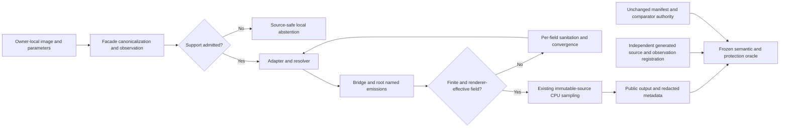

# Phase 93: Distinct Nose Bridge and Root Repairs — Research

**Researched:** 2026-09-09
**Domain:** Existing Swift still-image nose providers, sampling-map safety, independent semantic pixels
**Confidence:** HIGH for current implementation and acceptance contract; LOW for a passing repair candidate until the registration issue below is resolved.

<user_constraints>
## User Constraints (from CONTEXT.md)

The following decisions and deferred scope are copied verbatim. [VERIFIED: 93-CONTEXT.md]

### Locked Decisions

- D-01: Keep bridge definition and root narrowing distinct. Use the frozen
  noseBridge_0p30/bridgeDefinitionGain and noseRootNarrowing_0p25/rootWidthContraction
  contracts and all exact source/neutral/sibling comparisons from Phase 89.
- D-02: Preserve exact current caps and fail-closed support semantics. Do not
  manufacture support from an unrelated face region or borrow nose-tip/slim behavior.
- D-03: Freeze target/protected regions and numeric gates before production:
  source/neutral target >=500 changed pixels and >=2000 RGB delta; signed and
  sibling margins >=16 Q16; outside <=128/512; other nose-region groups <=64/256;
  background/watermark exactly0/0. Manifest/comparator remain unchanged.
- D-04: Use deterministic in-memory generated public-facade pixels and metadata,
  with independent observation-to-raster registration before output scoring.
  Assert neutral identity, extent/orientation/color/alpha, deterministic bytes,
  malformed/missing/provider-empty and valid-invalid-valid recovery as applicable.
- D-05: Validate actual renderer-effective support and overlapping fields, not
  only individual provider coordinates. Phase92 dense folding is a relevant
  lesson; do not claim injectivity from per-point limits alone.
- D-06: Prefer provider-local formulas and private helpers. Preserve shared
  renderer, root/tip ownership, sibling behavior and public inventory. New API,
  model/data/weights, UI, network, live portrait or device work is out of scope.
- D-07: One bounded research pass, one independently checked plan set, at most
  two implementation attempts for Phase93 before explicit owner repair/defer/stop.
  Phase92's special reopening does not extend to Phase93. Count attempts honestly;
  no autonomous threshold relaxation or third attempt.
- D-08: Independent code review and goal verification precede phase completion.
  Synchronize affected owners from measured evidence only. Preserve archived and
  failed historical records. Store only bounded aggregates/status/hashes, never
  raw pixels, geometry, masks, private locators, media/reports or transcripts.

### Discretion

CONTEXT.md has no separately titled discretion section. DISCUSSION-LOG.md states: [VERIFIED: 93-DISCUSSION-LOG.md]

> No unresolved product preference changes the authorized phase scope. Implementation
> choices remain for one bounded research pass and independent plan review.

### Deferred Ideas (OUT OF SCOPE)

Phase95 portraits/final65-output/no-skip; all UI/realtime/model/data/device or
external-distribution work; further FACE-01 repair remains separately deferred.
</user_constraints>

## Project Constraints (from AGENTS.md)

- Use the SDK-only Swift Package and SDK-owned validation; no UI/application lifecycle/automation, new backend, retained-shader edit, network, model/data/weight work or distribution. Swift `public` means owner-local access only. [VERIFIED: AGENTS.md; 93-CONTEXT.md]
- Read AGENTS/PLANS first and the relevant root owners; code/tests outrank PLANS, root owners, then historical docs. Taxonomy authority is `docs/SDK_EFFECT_TAXONOMY.md`. Update affected owners when their contracts change. [VERIFIED: AGENTS.md]
- Keep existing target directions, naming and abstraction boundaries. Do not overwrite unrelated local work or expand scope; record additional issues in PLANS. Historical archives/milestone evidence stay read-only; restoration, if separately requested, requires verification and an external temporary directory. [VERIFIED: AGENTS.md]
- Use generated, deterministic, in-memory fixtures and actual input/output pixels plus applicable metadata, extent, orientation/mirror, color, alpha, identity, locality, tolerance, determinism and typed-failure assertions. A successful process exit or nonzero point count is insufficient. [VERIFIED: AGENTS.md]
- Persist only bounded aggregates/status/hashes, never masks, landmarks, geometry, pixels, generated images, private locators or child transcripts. Use Boolean assertions for support/byte equality to avoid XCTest dumping arrays. [VERIFIED: AGENTS.md; BeautyEyebrowFixtureRegistrationTests.swift]
- Device testing is optional supplemental owner feedback, not a completion dependency. Do not infer device performance, naturalness, commercial quality or release/distribution qualification. Local use does not waive data/model licenses. [VERIFIED: AGENTS.md]
- Preserve provisional upper-eyelid naming and safety; local-retouch work remains deferred. Apply `spike-findings-beauty` only for the relevant canonicalization/privacy/oracle patterns, subject to current owners and scope. [VERIFIED: AGENTS.md; .codex/skills/spike-findings-beauty/SKILL.md]
- Serena is project-scoped and must not be switched across projects; use it for symbols when available. No Serena tool is exposed in this research session, and the orchestrator explicitly authorizes source/rg reads. No graph directory was present. [VERIFIED: tool inventory; orchestrator task; filesystem discovery]
- Implementation work records what changed, why, and how it was verified in PLANS and affected owners. This delegated task owns only this RESEARCH.md and must not commit or edit config/state/production. [VERIFIED: AGENTS.md; orchestrator task]

<phase_requirements>
## Phase Requirements

| ID | Description | Research Support |
|---|---|---|
| NOSE-01 | Positive `noseBridge` produces a detectable bridge-definition effect in the bridge semantic ROI on eligible input, remains independent from `noseRootNarrowing`, `noseSlim`, and tip controls, and preserves non-bridge protected regions within bounded tolerance. | Actual strength bug, bounded field proposal, frozen bridge metric and sibling oracle. [VERIFIED: REQUIREMENTS.md; provider; comparator] |
| NOSE-02 | Positive `noseRootNarrowing` produces detectable narrowing in the root semantic ROI on eligible input, never aliases `noseBridge`, preserves bridge/tip/non-nose protected regions, and retains its exact safety cap and fail-closed support handling. | Explicit-pair validation, root registration obstacle, horizontal field/overlap proposal, frozen half-centroid oracle. [VERIFIED: REQUIREMENTS.md; adapter; provider; comparator] |
</phase_requirements>

## Summary

`NoseWarpProvider` is the correct production seam. Bridge output currently maps its upper legacy nose points directly to the nose center X regardless of positive strength. CPU rendering derives displacement exclusively from `target - source`; it never multiplies the control point's `strength`. Consequently the bridge's strength metadata does not establish effective scaling. Root already scales target displacement and validates a separate symmetric pair. Both branches still use the same generic quadratic circular sampler and the nose helper's radius floor. [VERIFIED: NoseWarpProvider.swift: bridgePoints/rootNarrowingPoints/makePoint; BeautyGeometryEffectPipeline.swift: RenderableWarpPoint/warpedRGBABytes]

The planning-critical obstacle is **registration, before parameter tuning**. The adapter synthesizes legacy nose, root and tip points from admitted face bounds when the nose group is present. It does not consume observed nose coordinates. The canonical `.usableFace` observation used by Phase 90 and the explicit adapter regression place root support inside the frozen bridge raster region, outside the frozen root raster region. Current horizontal root motion cannot address that root region. Existing nose vector/count and renderer-inventory tests do not prove the frozen `rootWidthContraction` contract. [VERIFIED: BeautyEngineTestingSupport.swift: usableFace; BeautyFaceGeometryAdapter.swift: nose/noseRoot/noseTip; FaceShapeWarpProviderTests.testFaceGeometryAdapterKeepsLegacyNoseAndAddsExplicitRootAndTipSupports; BeautyEngineChinTaperRepairTests.swift; face-feature-batch-manifest.json]

**Primary recommendation:** Put an independent common-observation registration gate before production. Preserve the canonical baseline; do not relocate generated faces per effect, copy renderer outputs into expected images, change the manifest, or count a support/ROI mismatch as merely an inert algorithm RED. The bounded formula below is a reviewable mechanical candidate, not evidence that both requirements can pass. A complete production plan must resolve the root registration issue explicitly; if it cannot, surface that issue for owner repair/defer/stop instead of starting an unbounded repair search. [VERIFIED: D-01–D-07; registration derivation above]

## Architectural Responsibility Map

| Capability | Primary Tier | Secondary Tier | Rationale |
|---|---|---|---|
| Public normalization, caps and degradation | SDK planning | Public facade | Existing resolver owns effective strengths and conflict convergence. [VERIFIED: BeautyEffectResolver.swift; DESIGN.md] |
| Admitted observation and coordinate mapping | SDK detection/adapter | Testing SPI | Map once; nose support is group/bounds-derived, not a public geometry input. [VERIFIED: BeautyFaceGeometryAdapter.swift; BeautyEngineTestingSupport.swift] |
| Bridge/root local field and support admission | BeautyEffects provider | Resolver sanitation | Emit per-field work or fail closed; preserve sibling fields. [VERIFIED: NoseWarpProvider.swift] |
| Pixel sampling/composition | Shared CPU pipeline | Existing backend policy | Single immutable-source sampling pass; do not introduce a nose renderer. [VERIFIED: BeautyGeometryEffectPipeline.swift; ARCHITECTURE.md] |
| Semantic measurement and authority | SDK-owned comparator and XCTest | Generated public facade tests | Source/neutral/sibling metrics use frozen image-space regions. [VERIFIED: comparator; Phase 90–92 repair tests] |
| Full portrait and no-skip evidence | Phase 95 | Current phase focused evidence | Explicit phase ownership. [VERIFIED: ROADMAP.md; CONTEXT.md] |

## Standard Stack

| Component | Version | Use |
|---|---|---|
| Existing Swift Package | tools version 6.0; deployment macOS 14/iOS 17 | Retain existing targets and dependencies. [VERIFIED: BeautySDK/Package.swift] |
| Apple Swift/SwiftPM | installed Swift 6.3.3 | Build/filter XCTest with the installed toolchain; no upgrade is proposed. [VERIFIED: swift --version] |
| XCTest, Core Image, Core Graphics, Foundation | SDK-bundled; no independent package version | Existing public-facade test and RGBA8 rendering conventions. [VERIFIED: repair test imports; Package.swift] |
| Swift CLI comparator, Python, Bash | Python 3.9.6 available | Retain existing semantic, cleanup and boundary commands. [VERIFIED: python3 --version; scripts] |

No external package installation is needed. Package legitimacy gate and registry/version publication-date checks are not applicable; no npm/PyPI package is recommended. Context7 MCP was absent and `command -v ctx7` returned unavailable. Official SwiftPM documentation was consulted as fallback; implementation facts come from this repository and installed runtime. [VERIFIED: Package.swift; tool inventory; CLI probe] [CITED: https://www.swift.org/documentation/package-manager/]

## Architecture Patterns



Diagram summarizes the existing pipeline and the required independent test boundary. [VERIFIED: provider; adapter; resolver; geometry pipeline; D-04]

### Component Responsibilities

| File | Planning responsibility |
|---|---|
| `BeautySDK/Sources/BeautyEffects/Warp/NoseWarpProvider.swift` | Sole intended algorithm edit; private bridge/root helpers only. Preserve slim, wing, tip-size, tip-lift and generic helper behavior for siblings. [VERIFIED: D-06; existing named emissions] |
| `BeautySDK/Tests/BeautyEffectsTests/NoseWarpProviderTests.swift` | Provider eligibility, actual Float displacement, field sum, dense/boundary, cap/reuse tests. [VERIFIED: existing test owner] |
| `BeautySDK/Tests/BeautyCoreTests/BeautyEngineNoseRepairTests.swift` | Proposed new independent frozen-metric public output owner; not present at research time. [VERIFIED: test inventory] |
| `BeautySDK/Tests/BeautyEffectsTests/NoseFixtureRegistrationTests.swift` | Proposed new adapter-facing observation/raster registration owner; not present at research time. Use detection+effects test dependencies, avoiding a new production geometry exposure. [VERIFIED: Package.swift; test inventory] |
| `BeautySDK/Sources/BeautySDK/BeautyEngineTestingSupport.swift` | Existing Testing SPI; do not add effect-specific relocated fixtures without an independently justified, checked common observation. [VERIFIED: fixture implementation; D-04] |
| Manifest, comparator, renderer, shared sampler, backends, `Warp.metal` | Frozen authorities/read-only implementation context. [VERIFIED: CONTEXT.md] |

### 1. Actual sampling, not provider metadata

For each renderable control point define `d = target - source`. At normalized output sample `q`, the current quadratic field is `F(q) = q - Σ d_i * max(0, 1 - |q-target_i|/r_i)^2`. Only points with radius greater than `0.0001` and L1 displacement greater than `0.0001` survive. The sampler clamps the final lookup to the unit image, converts through `width-1`/`height-1`, bilinearly interpolates immutable input, and rounds all RGBA channels. These are current implementation rules, not a proposed renderer change. [VERIFIED: BeautyGeometryEffectPipeline.swift: RenderableWarpPoint, warpedRGBABytes, writeInterpolatedPixel]

Even a tiny nonzero active field can alter pixels because output coordinates use pixel centers while lookup uses `width-1`. Do not infer semantic effect from resampling alone. Confirm direction with frozen metrics and run protection on textured guards, not a uniformly white exterior that can hide support leakage. [VERIFIED: same sampler; comparator regionSignal]

### 2. Registration prerequisite and feasibility boundary

The canonical admission must be traced from the existing `.usableFace` Vision observation through `CoordinateMapper`, detection and `BeautyFaceGeometryAdapter`, and compared with the source-side, parameter-independent raster authority. The existing explicit adapter regression is the independent static witness for those generated supports. The new registration test should print only counts/Booleans. Geometry literals belong only in executable tests, not durable research/evidence. [VERIFIED: TestingSupport; FaceShapeWarpProviderTests; D-04/D-08]

On that baseline, root pair Y and its current support disk do not intersect the frozen root ROI. Because root changes X only, coefficient changes cannot repair this mismatch. Enlarging the disk until it reaches root also reaches the protected bridge and is not an acceptable shortcut. This is a specific baseline finding, not a claim that no conceivable observation can satisfy both contracts. No alternative common observation has been independently justified in this research. [VERIFIED: adapter source; root helper; frozen manifest; analytical comparison]

**Required planning disposition:** explain which canonical admitted observation registers both the bridge and root anatomy with their frozen regions without modifying the Phase 90 baseline. If a new common fixture is proposed, its geometry, source anatomy and admission rationale must be selected independently of candidate outputs and checked before production; it must run the entire sibling set from the same input/observation. Merely solving coordinates to move one effect into an ROI, or using a different input for each control, is not that justification. Until resolved, NOSE-02 implementation readiness is blocked by the acceptance/geometry mismatch, although the research pass itself is complete. [VERIFIED: D-01/D-04; orchestrator clarification]

### 3. Single bounded mechanical candidate for review

The following is a **proposal**, not a locked decision or measured successful repair. Its efficacy against the frozen oracle is unverified [ASSUMED: A1]. Do not implement it before the registration gate and independent plan check. There is one family here; no output-guided coefficient/radius sweep is recommended.

**Shared notation:** `W` is positive finite face width; `u = effectiveStrength / exactFieldCap` for finite `0 < effectiveStrength <= cap`. Keep public caps bridge `0.30`, root `0.25`, exact reused-strength factor `0.5`, existing conflict scales and nonfinite/negative normalization. A provider call outside the effective-strength range should fail closed rather than emit an uncapped field. [VERIFIED: BeautySafetyCaps.swift; DESIGN.md; resolver/degradation tests] [ASSUMED: A1 for proposed direct-call guard]

**Bridge:** retain the current prerequisite `center(face.nose)` and upper-nose membership. Validate finite normalized, in-bounds support before computing the center; use only its existing nose inputs. For each noncentral upper source `s_i`, set raw cap X displacement `b_i = center.x - s_i.x`, raw radius `r_i = clamp(0.08W, 0.03, 0.20)` and Y displacement zero. Scale the displacement in the target construction by `u`; do not encode amplitude only in `WarpControlPoint.strength`. Do not synthesize bilateral support from eyes/root/tip, add a nose payload, or broaden upper membership to lower-tip points. [VERIFIED: current bridge/makePoint seam] [ASSUMED: A1 for bounded replacement]

**Root:** preserve `validatedRootPair` as the sole support owner: exactly two distinct finite/unit/in-face points, same Y within the existing tolerance, straddling face mid-X, approximately symmetric, with both center distances above the existing minimum. Set `r = clamp(0.07W, 0.03, 0.20)`, `room = min(midX-left.x, right.x-midX)`, cap magnitude `b = min(0.025W, room-0.0001)`; proposed final targets are the original source pair plus/minus `u*b*scale` in X and exactly unchanged Y. Reject the pair together if either side is invalid or renderer-empty. Do not read legacy nose center to rescue missing root support; independent root currently works when legacy nose is empty. [VERIFIED: validatedRootPair; rootNarrowingPoints; testNewNoseFieldsDoNotDependOnLegacyNoseCenterGuard] [ASSUMED: A1 for added safety scaling]

**Field-sum budget:** for the quadratic kernel, each displacement contribution has Lipschitz bound `2*norm(d_i)/r_i`. As a conservative candidate, reserve `0.45` per repaired field, so isolated bridge+root combined have total at most `0.90`. Compute cap raw `L = Σ 2*norm(b_i)/r_i` in Double and choose one deterministic scale `min(1, 0.45/L)` (no scale for an empty/zero set). Use conservative Float slack before reconstruction; after conversion, recompute `2*Σnorm(actualTarget-actualSource)/actualRadius` and require it to be at most `0.45`. Reject the affected field on failure; do not retry with alternate constants. The numeric budget is proposed engineering discretion, not an existing acceptance threshold or proven visual choice. [VERIFIED: kernel derivative algebra from current sampler] [ASSUMED: A1 for budget/efficacy choice]

This bound handles same-field dense overlap and bridge/root overlap independently of circle positions. For each fixed strength, an unclamped field with total Lipschitz displacement less than one has `|F(p)-F(q)| >= (1-L)|p-q|`. It does **not** certify the final clamped raster, discrete bilinear quantization, GPU arithmetic, or arbitrary mixed sibling fields. Root/bridge's contribution to mixed plans is bounded, but unchanged sibling fields require explicit combined regression evidence. [VERIFIED: triangle-inequality derivation; CPU sampler; Phase92 R5 scope]

**Support and finite rules:** preflight every bounds component and arithmetic result, unit membership, source/target membership and radius; compute in a deterministic order. Validate both source and cap-target disks against the admitted semantic support owner, unit/face bounds and protected-region exclusions in the independent test. For moving target centers, source and cap endpoints bound intermediate centers; do not validate source-centered disks alone. If containment is incompatible with the existing radius floor, report/reject that support, not secretly change the global helper or move support. Require final renderer admission, not merely nonempty provider arrays; otherwise resolver active metrics can disagree with actual pixels. [VERIFIED: current helper/resolver/sampler; D-02/D-05] [ASSUMED: A1 for new private admission policy]

**Strength grid:** plan neutral, smallest representable effective work around the renderer L1 cutoff, half/reused, quarter, cap-adjacent and cap cases, plus representative post-conflict values. Caps and effective-strength halving stay exact; arbitrary Float source/target subtraction need not be bit-exact half unless an existing test actually requires it. Use tolerances derived from Float reconstruction for coordinate arithmetic, while requiring exact emitted strengths and deterministic final bytes. [VERIFIED: strength tests; renderer cutoff] [ASSUMED: A1 for proposed coverage]

### 4. Independent RED oracle

Build observation registration and metric unit tests first, then freeze hashes of source recipe, observation, metric helpers and thresholds before candidate output. The source must depict independently placed bridge definition and bilateral root content, plus high-frequency guards in protected nose/non-nose regions; a provider-derived disk mask is not an independent ROI. Use the same full input, neutral and observation for both candidate controls and every frozen sibling. [VERIFIED: D-01/D-04/D-05; Phase90–92 patterns]

The exact metrics differ. Bridge is mean Q8 darkness of the middle third of the frozen bridge raster minus mean darkness of its outer thirds. Root is negative Q16 separation of darkness centroids of the root rectangle's two halves. The report calls both margins Q16, but **bridge code does not convert its Q8 contrast into Q16**; reproduce the comparator literally, preserving its floor `16`. Do not replace bridge definition with width contraction or apply an extra fixed-point multiplier. [VERIFIED: comparator bridgeDefinitionGain/rootWidthContraction/darkHalfCentroidSpanQ16]

Use comparator integer PPM rasterization, integer thirds/half splits, luma `77R + 150G + 29B`, darkness `max(0, 255*256-luma)`, integer division and nonempty-denominator admission. Copy metric equations independently into test code; do not import the provider's helper. Independently authored flat/defined bridge and wide/narrow root transformations should test metric polarity; identical/uniform-shift/protected-only/watermark-only cases must fail the appropriate semantic conjunction. Never use those handcrafted expected transformations as evidence of a provider repair. [VERIFIED: comparator metric helpers and self-tests]

| Frozen row | Exact comparison IDs besides candidate | Required assertions |
|---|---|---|
| `noseBridge_0p30` / `bridgeDefinitionGain` | `source`, `geometryBaseline_noop`, `noseRootNarrowing_0p25`, `noseSlim_0p35`, `noseTipSize_plus0p30`, `noseTipSize_minus0p30` | Both source and neutral gain at least 16; minimum absolute candidate/sibling metric difference at least 16; frozen target/protection conjunction. [VERIFIED: manifest; comparator] |
| `noseRootNarrowing_0p25` / `rootWidthContraction` | `source`, `geometryBaseline_noop`, `noseBridge_0p30`, `noseSlim_0p35`, `noseTipLift_0p25` | Both source and neutral gain at least 16; minimum absolute candidate/sibling metric difference at least 16; frozen target/protection conjunction. [VERIFIED: manifest; comparator] |

For each candidate, target must have at least 500 pixels with a maximum RGB channel delta greater than 2 and at least 2000 total absolute RGB delta, separately against source and neutral. Outside maxima are 128/512, protected nose groups 64/256, and background/watermark 0/0. Sum RGB differences for all compared pixels, including those not counted changed. For actual renderer outputs preserve watermark-row exclusion; for unwatermarked generated facade inputs use the equivalent no-watermark measurement and separately assert the watermark guard is unchanged. [VERIFIED: manifest; comparator regionSignal/measureDirection/watermarkSafeRegions]

RED must fail because intended pixels do not meet these exact conditions, after source/detector/adapter registration passes. A registration failure is an infrastructure/prerequisite finding and earns no semantic credit. Keep both failure kinds distinct. [VERIFIED: SECURITY.md semantic admission; D-04]

## Don't Hand-Roll

| Problem | Do not build | Use instead |
|---|---|---|
| Amplitude application | New sampler or shader strength multiplication | Existing target-source displacement in private provider formulas. [VERIFIED: CPU pipeline] |
| Root support recovery | Bridge/slim/tip-derived replacement | Existing explicit root-pair validator and per-field sanitation. [VERIFIED: NoseWarpProvider.swift] |
| Detector fixture exposure | Public geometry/debug API | Existing Testing SPI and target-internal tests. [VERIFIED: Package.swift; TestingSupport] |
| Semantic success | Arbitrary byte difference or provider-point count | Frozen comparator equations and public-facade pixels. [VERIFIED: VAL-02; comparator] |
| Privacy/evidence lifecycle | New report format or persistent debug image | Existing bounded aggregate/script cleanup patterns. [VERIFIED: SECURITY.md; runner] |

## Runtime State Inventory

This is a provider repair rather than a rename or data migration. The five categories are stated explicitly because private helper refactoring is contemplated. No runtime state was modified or external service inventoried. [VERIFIED: delegated scope; tool actions]

| Category | Items Found / Scope | Action Required |
|---|---|---|
| Stored data | No schema/key/storage change in provider-only scope. [VERIFIED: provider; Package.swift] | No migration; no private fixtures opened. |
| Live service config | None referenced by the affected provider/pipeline. [VERIFIED: imports and call chain] | No service change. |
| OS-registered state | None referenced by this change; no OS registration survey needed for a local formula. [VERIFIED: affected source] | None. |
| Secrets/env vars | No secret or environment key rename. Existing script opt-ins belong to their established owners. [VERIFIED: scope; scripts] | Preserve opt-in policy; do not print values. |
| Build artifacts | SwiftPM build output can contain old compiled providers. [VERIFIED: SwiftPM project] | Rebuild selected tests; do not treat prior binaries as repaired evidence. |

## Common Pitfalls

1. **Strength-only repair is inert.** CPU ignores `point.strength`; change the actual finite target-source law and test half/cap pixels. [VERIFIED: sampler]
2. **Root is silently scored as bridge.** Canonical root registration currently conflicts with the root ROI. Do registration first and stop if unresolved. [VERIFIED: adapter + manifest]
3. **Zero vector still counted as emitted.** Existing single-point bridge tests accept a control point at its own center, while CPU drops it. Update only affected bridge expectations to the renderer-effective contract; do not rewrite wing/tip sibling prerequisites. [VERIFIED: testLegacyFieldEmissionsUseEachHelpersActualPrerequisites; RenderableWarpPoint]
4. **Radius floor defeats containment.** The private nose helper raises radii to 0.03. Inspect final radius and target center; don't reason only from `W*factor`. [VERIFIED: makePoint]
5. **One-point safety hides dense folding.** Phase92's R4 passed sparse pixels but failed dense same-side review. R5 fixed a sum budget, with narrow scope; test actual overlapping fields, not just matching that number. [VERIFIED: 92-06-SUMMARY.md; RELIABILITY.md Phase92]
6. **Sibling non-alias means different arrays.** Frozen acceptance needs a minimum metric margin on the same image/ROI. Whole nose/root/tip vectors merely being unequal is insufficient. [VERIFIED: NoseWarpProviderTests versus comparator]
7. **White guards hide leakage.** Exercise textured guards and renderer-effective disks in addition to the semantic fixture. Preserve frozen ceilings. [VERIFIED: bilinear sampler; D-05]
8. **Historical evidence becomes new credit.** Older six-field/252-output records establish their own contracts, not Phase89 semantic success. Full 65-output/portrait/no-skip belongs to Phase95. [VERIFIED: DESIGN.md Phase37; ROADMAP.md]

## Code Examples

Existing source-grounded arithmetic, shown without fixture geometry: [VERIFIED: BeautyGeometryEffectPipeline.swift; comparator]

```swift
// Existing CPU semantics; reference equation, not a requested renderer edit.
let displacement = point.target - point.source
let t = max(0, min(1, 1 - distance / point.radius))
sample -= displacement * (t * t) // current nose falloff is 2

// Independent metric source: scripts/compare-face-feature-batches.swift
let lumaQ8 = Int64(red) * 77 + Int64(green) * 150 + Int64(blue) * 29
let darkness = max(0, Int64(255 * 256) - lumaQ8)
// bridge = centerDarkness / centerCount - outerDarkness / outerCount
// root = -(rightHalfCentroidQ16 - leftHalfCentroidQ16)
```

For comparisons on raw support or full output buffers, follow registration tests' Boolean assertion style (`XCTAssertTrue(lhs == rhs, "bounded equality status")`) rather than assertions that print the arrays when unequal. [VERIFIED: BeautyEyebrowFixtureRegistrationTests.swift; D-08]

## State of the Art

| Prior repository evidence | Current required evidence | Impact |
|---|---|---|
| Upper bridge control points and capped metadata | Actual strength-scaled public bytes and bridge contrast | Coordinate count is insufficient. [VERIFIED: provider tests; comparator] |
| Root/tip distinct vectors and generic outputs | Root half-centroid contraction, sibling margin, bridge protection | Resolve coordinate registration explicitly. [VERIFIED: nose tests; manifest] |
| Sparse Phase92 R4 semantic pass | Accepted R5 actual field-sum and dense regression | No inherited arbitrary-field injectivity claim. [VERIFIED: 92-06-SUMMARY.md] |

No framework upgrade or new package is proposed. [VERIFIED: scope; Package.swift]

## Environment Availability

| Dependency | Available | Version / Evidence | Fallback |
|---|---|---|---|
| Swift/SwiftPM | Yes | Swift 6.3.3, arm64 Apple host. [VERIFIED: CLI] | None needed. |
| Python | Yes | 3.9.6. [VERIFIED: CLI] | None needed for existing scripts. |
| Node/GSD init | Yes | Node 26.0.0; phase-op resolved phase93 directory. [VERIFIED: CLI] | None needed. |
| XCTest/CoreImage/CoreGraphics | Project/toolchain dependency | Existing source imports; no compilation run in this research. [VERIFIED: Package.swift; test sources] | Build during execution. |
| Context7/ctx7 | Unavailable | Tool inventory + command probe. [VERIFIED: discovery] | Official docs and repository source. |
| Serena | Unavailable in current tool inventory | Explicit orchestrator fallback. [VERIFIED: discovery/task] | Source/rg. |
| Private portraits, physical devices | Not required for Phase93 | Phase95/optional owner feedback. [VERIFIED: CONTEXT.md; AGENTS.md] | Generated fixtures, without portrait credit. |

Missing execution prerequisite: a justified common observation/raster registration for both frozen nose semantics. This is an acceptance design issue, not a missing runtime or package. [VERIFIED: registration analysis]

## Validation Architecture

Validation and security are enabled in `.planning/config.json`; research performs source/tool availability checks only. No production experiment, generated image, SwiftPM run or private fixture access occurred. [VERIFIED: config; tool actions]

### Test Framework

| Property | Value |
|---|---|
| Framework | Existing XCTest through installed Swift 6.3.3. [VERIFIED: test imports; CLI] |
| Configuration | `BeautySDK/Package.swift`. [VERIFIED: filesystem] |
| Quick provider run | `swift test --package-path BeautySDK --filter NoseWarpProviderTests` [VERIFIED: class name] |
| New registration run | `swift test --package-path BeautySDK --filter NoseFixtureRegistrationTests` — proposed, must first discover a nonzero test count. [VERIFIED: currently absent] |
| New semantic run | `swift test --package-path BeautySDK --filter BeautyEngineNoseRepairTests` — proposed, must first discover a nonzero test count. [VERIFIED: currently absent] |
| Broader relevant suite | `swift test --package-path BeautySDK --filter 'NoseWarpProviderTests|NoseFixtureRegistrationTests|BeautyEngineNoseRepairTests|BeautySafetyCapsTests|BeautyEffectResolverTests|GeometryConflictResolverTests|CombinedEffectSafetyTests|MissingLandmarkDegradationTests|CPUReferenceGeometryOracleTests|CPUReferenceFacadeFixtureTests|CPUReferenceDeterminismTests|BeautyEngineGeometryFacadeTests|BeautyParametersTests'` [VERIFIED: existing class names plus explicitly proposed classes] |

Durations were not measured. Do not promise any filter finishes in under 30 seconds; warm provider/individual test filters are the narrow sampling unit, while the combined suite is a wave gate. [VERIFIED: no test execution in this pass]

### Phase Requirements → Test Map

| Requirement | Behavior | Type | Command / existing owner | Exists? |
|---|---|---|---|---|
| NOSE-01/02 prerequisite | Common source/observation/adapter matches frozen regions before rendering | Unit/integration registration | New `NoseFixtureRegistrationTests` | No — Wave 0; unresolved design |
| NOSE-01 | Bridge strength changes actual displacement; finite/bounded and dense-safe | Provider unit | `--filter NoseWarpProviderTests` | Yes; extend |
| NOSE-02 | Explicit pair, exact X direction/Y identity, root failure isolation and true rendering admission | Provider unit | `--filter NoseWarpProviderTests` | Yes; extend |
| NOSE-01 | Frozen bridge contrast, target signals, complete sibling set/protection | Public actual-pixel integration | New `BeautyEngineNoseRepairTests` bridge method | No — Wave 0 RED |
| NOSE-02 | Frozen root contraction, target signals, complete sibling set/protection | Public actual-pixel integration | New `BeautyEngineNoseRepairTests` root method | No — Wave 0 RED |
| NOSE-01/02 safety | Dead zone, half/reuse, stale/missing, provider-empty, mixed convergence | Unit/integration | Existing MissingLandmarkDegradation, resolver, combined classes | Yes; retain and extend only gaps |
| NOSE-01/02 safety | Neutral identity, same-engine valid-invalid-valid, deterministic bytes, extent/orientation/mirror/color/alpha and typed failure | Public integration | New nose suite + existing facade/CPU reference suites | Partly; add nose-specific cases |

Table mappings are planning recommendations grounded in current test owners, not claims that the new tests already pass. [VERIFIED: test inventory; D-04]

### Wave 0 Gaps and Sequence

- [ ] Registration gate with an independently justified common observation and frozen source recipe. If unresolved, stop the production plan here. [VERIFIED: D-04; registration finding]
- [ ] Independent exact integer bridge/root metrics, source-side positive/negative/admission tests and Boolean privacy-safe assertions. [VERIFIED: comparator equations; new files absent]
- [ ] Public-facade RED for each requirement, preserving every threshold, sibling and protected group. Pin method/fixture/manifest/comparator hashes before production. [VERIFIED: D-01/D-03/D-04]
- [ ] Provider tests for effective strengths versus final displacements, L1 cutoff transitions, full effective field sums, boundary density, root symmetry/Y invariance, combined bridge/root and existing siblings. [VERIFIED: D-05; current gaps]
- [ ] Define honest attempt accounting in the checked plan: at most two substantive production candidates; compile/fixture failures are recorded accurately and never silently treated as a successful attempt or a renewed budget. [VERIFIED: D-07]

### Phase Gates

Run in a sequence that establishes registration/RED before mutation and then provider, semantic, compatibility and source-boundary conjunction. Require zero failures and zero skips in new/focused nose tests, a nonzero denominator and each required new method discovered once. Existing opt-in portrait skips must remain explicitly accounted for outside nose acceptance. [VERIFIED: D-04/D-08; AGENTS.md; prior Phase92 closeout]

```bash
swift test --package-path BeautySDK --filter NoseWarpProviderTests
swift test --package-path BeautySDK --filter NoseFixtureRegistrationTests
swift test --package-path BeautySDK --filter BeautyEngineNoseRepairTests
swift scripts/compare-face-feature-batches.swift --self-test
bash scripts/run-face-feature-batches.sh --self-test-boundaries
bash scripts/run-face-feature-batches.sh --self-test-report-cleanup
bash scripts/check-backend-neutral-contract.sh
python3 scripts/archive-legacy-ui.py verify --output archives/legacy-ui
bash scripts/check-sdk-only-boundary.sh --post-archive
git diff --check
```

These command interfaces exist except the two explicitly proposed test classes. The comparator/runner are frozen and need no edits. Preflight `bash scripts/run-face-feature-batches.sh --preflight-only` may verify exact `75/65/8` under the established local path policy without rendering; avoid printing private paths and do not mistake it for 65 rendered results. Full `scripts/run-no-skip-swiftpm.sh`, portrait evaluation and final 65-output publication remain Phase95. [VERIFIED: script usage/source; CONTEXT.md]

Before acceptance, verify unchanged manifest/comparator/shader blobs, unchanged sibling helper behavior and 62 fields/5 presets/75 cases/both facades/backend policy; synchronize DESIGN, PRODUCT_SENSE, RELIABILITY, QUALITY_SCORE and PLANS only to measured outcomes. Add SECURITY/ARCHITECTURE changes only for a real changed contract. Independent code review and goal verification are mandatory. [VERIFIED: AGENTS.md; D-08]

## Security Domain

ASVS is a web-application standard; use relevant controls as a checklist, not a compliance certification for this owner-local package. The official stable version is 5.0.0 (released 2025-05-30); the older template's V2-auth/V3-session/V4-access/V5-input/V6-crypto numbering is not ASVS5 numbering. [CITED: https://owasp.org/www-project-application-security-verification-standard/] [CITED: https://github.com/OWASP/ASVS/tree/v5.0.0/5.0/en]

| ASVS5 category | Applies to this phase | Control |
|---|---|---|
| V2 Validation and Business Logic | Yes | Finite/bounds/cardinality/ownership checks, effective-work admission, deterministic failure and attempt policy. [VERIFIED: provider; SECURITY.md] |
| V5 File Handling | Existing test-script boundary only | Existing path admission, no-follow/cleanup and archive checks; no new image-file persistence. [VERIFIED: runner; SECURITY.md] |
| V6 Authentication / V7 Session / V8 Authorization | No new account/session/network surface | Preserve owner-local scope; no auth subsystem is proposed. [VERIFIED: Package.swift; scope] |
| V11 Cryptography | Existing evidence binding only | Existing hash tooling; no custom cryptography or secrets. [VERIFIED: gate scripts] |
| V14 Data Protection / V16 Logging and Error Handling | Yes | Request-local geometry/media, Boolean tests, bounded aggregates and no raw framework errors/transcripts. [VERIFIED: SECURITY.md; D-08] |

Category names above were verified against the official tagged ASVS5 table of contents; applicability is repository-scoped mapping, not an ASVS level claim. [CITED: https://github.com/OWASP/ASVS/tree/v5.0.0/5.0/en]

| Threat | STRIDE | Standard mitigation |
|---|---|---|
| Unsupported/anatomically unrelated proxy earns semantic credit | Spoofing/Tampering | Independent registration and strict source/neutral/sibling admission. [VERIFIED: frozen semantic trust boundary] |
| NaN, near-zero support, large/dense overlap generates an unsafe field | Tampering/Denial of Service | Bounded support, finite actual Float arithmetic, renderer-effective and summed-field tests. [VERIFIED: provider/sampler; D-05] |
| Tests print raw geometry/pixels/private paths | Information Disclosure | Boolean assertions and aggregate-only evidence; no generated files. [VERIFIED: AGENTS.md; registration pattern] |
| Changed fixture/threshold masquerades as repair | Repudiation/Tampering | Freeze hashes before production, independent review and honest attempt ledger. [VERIFIED: D-03/D-07/D-08] |

## Assumptions Log

| # | Claim / proposed decision | Section | Risk if wrong |
|---|---|---|---|
| A1 | The single strength-scaled, quadratic field family with a 0.45 per-field derivative budget and stricter private renderer-effective admission is a viable bridge/root repair after independent registration. It is a mathematically bounded candidate, not a demonstrated pixel success or approved contract change. | Bounded candidate | Frozen semantic signal may remain insufficient; old eligibility expectations may need a precise scope review. Check before implementation, stop on registration conflict, and do not lock efficacy or constants as verified facts. |

No unverified package recommendation, new policy requirement or portrait efficacy claim is included. [VERIFIED: this document's scope]

## Open Questions

1. **Which independently justified common observation/source can register root and bridge against the frozen image-space ROIs?** Existing canonical `.usableFace` and explicit adapter tests establish a root/ROI mismatch. No registered replacement was established; no production tuning was run. Planner must resolve this before a complete NOSE-02 execution plan. Do not change frozen ROIs, relocate inputs per effect, or invent observed-nose provenance. [VERIFIED: source analysis; orchestrator clarification]
2. **Can the reviewed bounded candidate satisfy both semantic floors and protection simultaneously?** Unknown until the prerequisite and immutable RED are satisfied; the family is not a proven success. Preserve at most two attempts and escalate repair/defer/stop after the authorized ceiling. [ASSUMED: A1] [VERIFIED: D-07]
3. **Which exact legacy bridge tests assert ineffective emission rather than supported behavior?** The single-point prerequisite method currently expects an emitted zero vector. Any changed bridge expectation must explain renderer admission while preserving all unaffected wing/tip/root behavior; do not wholesale rewrite legacy tests. [VERIFIED: NoseWarpProviderTests.testLegacyFieldEmissionsUseEachHelpersActualPrerequisites; sampler]

## Sources

### Primary — HIGH confidence

- Repository authorities: `AGENTS.md`, active `PLANS.md`, `ARCHITECTURE.md`, `DESIGN.md` nose contracts, `SECURITY.md` semantic trust boundary, `RELIABILITY.md` semantic/Phase92 contracts, `PRODUCT_SENSE.md`, `QUALITY_SCORE.md`, `docs/SDK_EFFECT_TAXONOMY.md`. [VERIFIED: source reads]
- `.planning/phases/93-distinct-nose-bridge-and-root-repairs/93-CONTEXT.md`, `93-DISCUSSION-LOG.md`, active ROADMAP/REQUIREMENTS and config. [VERIFIED: source reads]
- `BeautyFaceGeometryAdapter.swift`, `NoseWarpProvider.swift`, `BeautyGeometryEffectPipeline.swift`, `BeautyEngineTestingSupport.swift`, `BeautySDK/Package.swift`. [VERIFIED: source reads]
- `NoseWarpProviderTests.swift`, explicit adapter regression in `FaceShapeWarpProviderTests.swift`, resolver/caps/degradation/combined tests; Phase90 chin and Phase91/92 public repair tests; `BeautyEyebrowFixtureRegistrationTests.swift`. [VERIFIED: source reads]
- `scripts/face-feature-batch-manifest.json` and `scripts/compare-face-feature-batches.swift`. Current Git blob IDs respectively `8cfa6673a0d8647db79355b36dfa1d48be7024e1` and `a2924de0100f4d32fbf7b5decd981b3decef7316`; retained shader blob `f11eb22e54c72b1a1119f21ca28343208c1b3a9e`. Recapture before execution; research did not change them. [VERIFIED: git hash-object]
- Phase92 accepted R5 context in `92-06-SUMMARY.md`, `92-04-SUMMARY.md`, PLANS and RELIABILITY; no historical evidence modified. [VERIFIED: source reads]
- `spike-findings-beauty/SKILL.md` and `references/still-image-integration.md`: canonicalize once, independent oracle, request-local evidence; current scope overrides historical device/release suggestions. [VERIFIED: skill reads; AGENTS.md]
- [OWASP ASVS official project](https://owasp.org/www-project-application-security-verification-standard/) and [tagged ASVS5 contents](https://github.com/OWASP/ASVS/tree/v5.0.0/5.0/en): version and category names only. [CITED: official pages]

### Documentation lookup limitations

- Context7 and ctx7 were unavailable. The official [SwiftPM entry](https://www.swift.org/documentation/package-manager/) redirects to docs.swift.org; [Apple XCTest](https://developer.apple.com/documentation/xctest) returned a JavaScript page and its Markdown retrieval failed. No library capability is inferred from these incomplete fetches; existing compiled-source conventions and installed toolchain provide the relevant facts. [VERIFIED: documentation/tool results]

## Metadata

| Area | Confidence | Reason |
|---|---|---|
| Stack and current semantics | HIGH | Live package, provider, adapter, sampler and comparator inspected. |
| Registration problem | HIGH for existing canonical baseline | Independently pinned adapter expected geometry and frozen raster definitions disagree for root. |
| Candidate effectiveness | LOW | No registered RED/public pixels or implementation experiment in this read-only pass. |
| Safety pitfalls | HIGH | Current sampler algebra and accepted Phase92 dense-field correction; claims kept scoped. |

**Research date:** 2026-09-09. **Validity:** tied to current source/authority hashes; recheck if those change, otherwise planning use within 30 days. This is the single bounded Phase93 research pass; no source/test experiments or private fixtures were used. Research is complete; production planning remains conditional on the explicit registration disposition. [VERIFIED: task scope; tool history]
