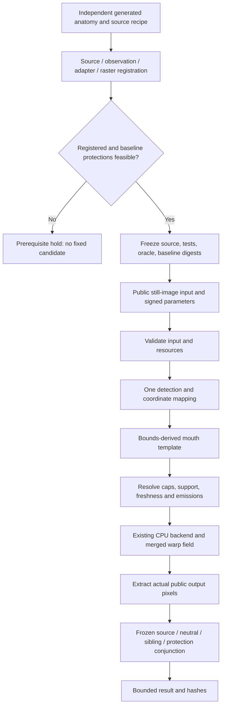

# Phase 94: Negative Mouth-Width Repair — Research

**Researched:** 2026-09-11. **Domain:** owner-local Swift still-image mouth geometry. **Confidence:** HIGH for source diagnosis; LOW for unmeasured repair efficacy. **Disposition:** prerequisite-blocked for fixed-candidate selection. This completes the one bounded source research pass; it is not semantic RED, native validation, or an implementation attempt. [VERIFIED: current research execution; 94-CONTEXT.md D-03/D-06]

<user_constraints>
## User Constraints (from CONTEXT.md)

The following decisions and deferred scope are copied verbatim. [VERIFIED: 94-CONTEXT.md]

### Locked Decisions

- D-01: Existing signed mouthWidth and exact ±0.35 cap remain; preserve positive outputs and all sibling controls. Do not alias mouthSize or invert both signed directions.
- D-02: Phase89 mouthWidth_minus0p35 contract remains frozen: all five comparisons (source, neutral, positive width and both signed sizes), target/protected regions and numeric predicates unchanged. Measure real public-facade input/output pixels; arbitrary changed pixels or provider targets alone cannot establish contraction.
- D-03: Establish independent source/observation/adapter/raster registration before scoring or changing production. Use deterministic generated in-memory fixtures; retain baseline positive/sibling pixel digests before repair. Do not relocate fixture anatomy after observing candidate results. Bounds-derived adapter templates are not observed individual anatomy.
- D-04: Preserve actual metadata contract, neutral identity, alpha, size/extent, supported orientation/mirror behavior, deterministic output, invalid/missing support isolation and recovery. Derive renderer-effective displacement/cutoff and whole-field safety from existing sampler; do not infer rendered motion solely from point.strength.
- D-05: Keep production changes within private negative width implementation unless evidence establishes a required broader contract change and it is explicitly authorized. Preserve positive width, all siblings, shared renderer/sampler, retained Warp.metal, backend policy, 62 fields, five presets and 75 renderer cases.
- D-06: One bounded research pass, one independently checked plan set and at most two substantive implementation attempts. Freeze tests and oracle before first production mutation; retain failures, source hashes and rollback evidence. A terminal prerequisite failure or two failed attempts requires explicit repair/defer/stop disposition, never an automatic third attempt or gate relaxation. Phase93-specific adapter/attempt authorizations do not transfer.
- D-07: Independent code review and goal verification plus affected owner synchronization precede completion. Persist only bounded aggregates/status/hashes; raw pixels, geometry, private locators and child transcripts remain absent from durable evidence. Reuse finite child deadlines with cold-build costs accounted for, exact test selection and cleanup.
- D-08: Phase95 owns private portrait/final65-output/full-no-skip closeout. No UI, network, model/weight/data work, real-device requirement or external-distribution claim is added. FACE-01 remains deferred.

### Agent's Discretion

No separate discretion section exists in the context. Its existing scope leaves technical diagnosis to implementation work; no broader authorization is inferred. [VERIFIED: 94-CONTEXT.md introductory paragraph and code_context]

### Deferred Ideas (OUT OF SCOPE)

Phase95 closeout, optional later device feedback and all out-of-scope controls remain separate.
</user_constraints>

## Project Constraints (from AGENTS.md)

- Treat repository source/tests as evidence; do not invent missing facts. Read AGENTS/PLANS first, then relevant owner contracts and source/tests. Conflict order is code/tests, PLANS, root owners, historical docs; taxonomy authority is `docs/SDK_EFFECT_TAXONOMY.md`. Record what changed, why and verification limits. [VERIFIED: AGENTS.md §§1–2]
- Preserve SwiftPM target/dependency boundaries, naming and abstraction level. Active surfaces are the library and SDK-owned command-line validation. Do not add application/UI/lifecycle/automation or use historical UI as requirements. Archives and archived milestone evidence are read-only; any future restoration requires verification and a fresh temporary destination outside the repository. [VERIFIED: AGENTS.md §§3–5,7–8]
- Public means owner-local Swift access, not third-party distribution. No source/binary/model/fixture distribution, license expansion, new model/weight/data work, Metal/backend expansion or retained shader modification. Preserve provisional upper-eyelid naming, safe behavior and weak-effect qualification. Internal use still requires actual-use license permission; research-only data remains isolated. [VERIFIED: AGENTS.md §5]
- Keep raw anatomy, masks, pixels, private locators and child output out of durable evidence. Use the project `spike-findings-beauty` skill for fixture/privacy work; its historical canonical-retouch guidance does not override the current raw geometry Device RGB contract or current optional-device policy. [VERIFIED: AGENTS.md §§4–6; DESIGN.md canonical-carrier/legacy overload contract; .codex/skills/spike-findings-beauty/SKILL.md]
- Use deterministic generated in-memory images and actual input/output pixel and metadata assertions: extent, dimensions, orientation/mirror, color, alpha, neutral identity, target changes, protected stability, tolerances, determinism and typed failures. Passing process status is insufficient. Rights-approved local algorithm gates remain separate from optional physical-device feedback. No device/commercial/release claims follow from generated evidence. [VERIFIED: AGENTS.md §6]
- Follow Orient/Scope/Edit/Verify/Record; choose the narrow meaningful test or SDK gate. Implementation must synchronize PLANS and affected owners: PRODUCT_SENSE for callable behavior, ARCHITECTURE for architecture, SECURITY for risks and RELIABILITY for errors/logs/performance. Do not expand scope or overwrite unrelated local changes; record extra issues as debt. Archive-first all-opt-in, nonzero, zero-failure/zero-skip closeout remains required at its assigned milestone stage. [VERIFIED: AGENTS.md §§7–9]
- Serena is project-scoped and normally preferred for symbols; it is unavailable in this session, and the user explicitly authorizes source/rg fallback. Only this research file may be written: no production/tests, commits, PLANS/state/config updates, native/render runs, dependency installs or web research in this pass. These explicit task restrictions override the general recording/commit workflow for this pass. [VERIFIED: user instructions; tool inventory; initial git status]

<phase_requirements>
## Phase Requirements

| ID | Description | Research Support |
|---|---|---|
| MOUTH-01 | Negative `mouthWidth` measurably contracts mouth width in the expected direction on eligible input; the already-detected positive direction remains correct, both directions are distinct from whole-mouth `mouthSize`, and mouth height, surrounding face, and background remain protected. | Registration prerequisite, sampler derivation, frozen conjunction and positive/sibling preservation tests below. [VERIFIED: .planning/REQUIREMENTS.md, Mouth] |
</phase_requirements>

## Summary

**Do not implement a sign flip or amplitude increase.** `widthPoints` already constructs two inward negative targets. Its shared `makePoints` sets positive strength metadata, but the CPU sampler uses the actual target-minus-source displacement without multiplying by that strength. The renderer admits ordinary cap-strength points, so a missing strength multiplication or renderer cutoff is not the canonical cap-strength explanation. [VERIFIED: MouthWarpProvider.swift:widthPoints/makePoints; BeautyGeometryEffectPipeline.swift:RenderableWarpPoint/warpedRGBABytes]

The retained canonical observation and the Phase93 registered-nose observation have the same horizontal face span. Their mouth templates do not register either corner inside the frozen left/right mouth regions. Source-only arithmetic for the canonical 512-square case counts 129 destination samples within the negative warp disks and the target union, versus 3,059 inside protected mouth-height space. This is a structural placement/footprint mismatch, not a measured pixel failure; color conversion, bilinear reconstruction and actual anatomy still require public-output tests. The inspected nose drawing contains nose/brow/eye marks, not an independent mouth drawing; the generic facade fixture is a channel pattern. Neither establishes MOUTH-01 anatomical eligibility. [VERIFIED: BeautyEngineTestingSupport.swift:usableFace/phase93RegisteredNose; BeautyFaceGeometryAdapter.swift:outerLips; NoseRepairFixture.swift:source; CPUReferenceFacadeFixtureFactory.swift; source arithmetic audit in this pass]

**Primary recommendation:** plan a registration prerequisite with a stop boundary; do not select a fixed provider candidate yet. The existing canonical fixture cannot be repaired into independent mouth registration by changing negative targets. A different source-first framing might admit a smaller negative-only footprint, but no independently specified and registered mouth source was established in this pass. Do not create its anatomy from adapter outputs or relocate it to pass the metric. [VERIFIED: 94-CONTEXT.md D-03/D-05; registration derivation below] [ASSUMED: A1, a different independently justified source framing can satisfy registration and all retained-positive protections]

## Architectural Responsibility Map

| Capability | Primary tier | Secondary tier | Responsibility |
|---|---|---|---|
| Input validation and public result | Local SDK facade | Backend request | `BeautyEngine` validates and selects the raw still-image route. [VERIFIED: BeautyEngine.swift:processResult/legacyStillImageResult] |
| Observation admission and mapping | Local detection | Core coordinate mapper | One observation provider invocation; geometry-purpose required-group admission; Vision-to-image mapping. [VERIFIED: VisionFaceDetector.swift:detect/mapObservation; CoordinateMapper.swift] |
| Mouth geometry | Local effects adapter | Detection group flags | Bounds-derived lip templates; not observed-lip anatomy. [VERIFIED: BeautyFaceGeometryAdapter.swift:makeGeometry/outerLips] |
| Signed eligibility and conflicts | Local effects resolver/provider | Core safety caps | Freshness, cap, per-field emissions, retained-mask convergence. [VERIFIED: BeautyEffectResolver.swift; MouthWarpProvider.swift] |
| Actual warp | Local CPU effects rendering | Core Image rasterization | Merged target-centered fields and one original-buffer bilinear read. [VERIFIED: BeautyCPUBackend.swift; BeautyGeometryEffectPipeline.swift] |
| Registration and efficacy evidence | SDK-owned tests | Phase94 bounded gate | Source-first anatomy proof before public pixels; frozen oracle and hash-only bindings. [VERIFIED: 94-CONTEXT.md D-02–D-07] |

## Standard Stack

| Component | Version/status | Use |
|---|---|---|
| Existing SwiftPM package | Declared tools version 6.0; iOS 17/macOS 14 minimum | Keep target graph unchanged. Installed compiler version was deliberately not executed. [VERIFIED: BeautySDK/Package.swift; current pass command record] |
| Existing Apple Core Image/Core Graphics/ImageIO | SDK-provided; exact installed SDK version not probed | Actual still-image facade and explicitly named-sRGB measurement extraction; retain Device RGB emitting raw path. [VERIFIED: BeautyGeometryEffectPipeline.swift; BeautyEngineNoseRepairTests.swift] |
| Existing XCTest | Toolchain-provided; no new dependency | Registration, independent metric oracle, public pixel and provider/resolver tests. [VERIFIED: Package.swift test targets; existing test imports] |
| Existing Python standard library and CryptoKit | Already used by phase gates/tests; no version change proposed | Bounded orchestration, checked parsing and SHA-256 bindings. [VERIFIED: scripts/check-phase93-nose-repair.py; BeautyEngineNoseRepairTests.swift imports] |

**Installation:** none. There is no external-package recommendation, registry lookup, slopcheck install or dependency change. Documentation lookup is unnecessary for these inspected local implementation facts; no library API/version claim is imported from training. [VERIFIED: user task scope; BeautySDK/Package.swift]

## Architecture Patterns

### System architecture diagram

Source-proven ownership and intended prerequisite ordering; the validation branch below is proposed, not executed. [VERIFIED: BeautyEngine.swift; BeautyEngineGeometryDetection.swift; BeautyEffectResolver.swift; BeautyCPUBackend.swift; 94-CONTEXT.md D-03]



### Component responsibilities and proposed test locations

| File/symbol | Planning action |
|---|---|
| `BeautyEngine.swift:legacyStillImageResult`, `BeautyEngineGeometryDetection.swift:resolveStillImageGeometry` | Preserve; raw mouth-only requests bypass canonical local-retouch admission. [VERIFIED: source] |
| `VisionFaceDetector.swift:mapObservation`, `CoordinateMapper.swift:toImageNormalized` | Exercise actual mapping, including the Vision Y flip and input orientation/mirror, once. [VERIFIED: source] |
| `BeautyFaceGeometryAdapter.swift:makeGeometry/outerLips` | Preserve; explicit `imageBounds` dominate area fallback. The observed lip payload is not consumed to build mouth warp support. [VERIFIED: source] |
| `MouthWarpProvider.swift:widthPoints` | Only potential production correction site; do not change `makePoints`, size or sibling paths. No fixed replacement authorized by this report. [VERIFIED: 94-CONTEXT.md D-05; provider call graph] |
| `Tests/BeautyCoreTests/MouthRepairFixture.swift`, `MouthFixtureRegistrationTests.swift` | Proposed new source recipe and real mapping proof, initially prerequisite-only. [VERIFIED: D-03; existing NoseFixtureRegistrationTests pattern] |
| `Tests/BeautyCoreTests/MouthSemanticMetricTests.swift`, `BeautyEngineMouthWidthRepairTests.swift` | Proposed independent oracle and public raw-facade measurements after registration. [VERIFIED: D-02/D-04; existing nose test organization] |
| `Tests/BeautyEffectsTests/MouthRepairFieldTests.swift` | Proposed final-Float field safety and negative-only scope checks, only after a candidate is admitted. [VERIFIED: D-04/D-05] |
| `scripts/check-phase94-mouth-repair.py` | Proposed dedicated gate with immutable local bindings; never reuse Phase93 receipts or mutate historical gates. [VERIFIED: D-06/D-07] |

### First-principles sampler derivation

Let `B` be the validated normalized face width, `s` the capped signed width, `d` its requested displacement magnitude and `r` the final emitted radius. Normal-strength legacy width uses `d = B * 0.040 * abs(s) / 0.35`, with a small provider floor, and `r = clamp(B * 0.11, 0.035, 0.20)`. Negative left/right target deltas have opposite inward signs and zero Y delta. Both source and target must remain valid support points; shared construction rejects the whole supplied array on failure. [VERIFIED: MouthWarpProvider.swift:widthPoints/legacyRenderableDisplacement/makePoints]

For destination pixel-center normalized position `q`, each admitted point contributes `D * (1 - distance(q,t)/r)^2` inside the strict target-centered disk, where `D = t - source`. The sampler computes `sample = q - sum(contributions)`, clamps it, then multiplies X/Y by `width-1`/`height-1` for bilinear reads from the original raster. `point.strength` is not used here. Admission requires radius **strictly greater than 0.0001** and displacement L1 magnitude **strictly greater than 0.0001**. There is no separate weight cutoff: every sample strictly inside a disk is rewritten, however small its weight. [VERIFIED: BeautyGeometryEffectPipeline.swift:warpedRGBABytes/RenderableWarpPoint/falloffWeight]

Provider-emitted does not mean renderer-admitted: `Float.ulpOfOne` and the legacy displacement floor are smaller than the renderer threshold. For unrounded ordinary width, admission requires `abs(s) > 0.000875 / B`; exact boundary tests must use reconstructed Float targets and the renderer's actual L1 comparison, including conflict weakening and reuse. Changing only strength metadata cannot repair a discarded vector. [VERIFIED: source algebra from widthPoints and RenderableWarpPoint; BeautyEffectResolver.swift]

An active pixel with very small displacement still samples a different raster basis: even with a vanishing field, `sampleX - column = 0.5 - q.x` and similarly for Y. Thus horizontal-only vectors do not establish exact mouth-height or alpha preservation. Disk-edge resampling can alter textured pixels despite tiny weight, and the strict footprint must be included in safety reasoning. At the canonical cap the displacement factor at the sampler's 511 scale is about 8.176 pixels, not that value multiplied by 0.35. This is a sampling term, not a measured feature trajectory. [VERIFIED: algebra from warpedRGBABytes; source arithmetic audit]

For quadratic falloff a conservative continuous-field Lipschitz bound is `sum(2 * norm(D_i) / r_i)`. Disjoint disks permit taking the maximum local bound instead of the sum; overlapping/mixed fields require the appropriate sum and actual final Float deltas. The canonical negative pair has disjoint disks and a local bound about 0.727273. A sum bound greater than one would merely fail that sufficient proof, not prove folding. These statements concern the unclamped continuous field; they do not prove bilinear raster injectivity, boundary continuity, mixed-control safety or GPU parity. [VERIFIED: mathematical differentiation of the inspected sampler; source arithmetic audit; NoseWarpProvider.swift:phase93Points final-budget precedent]

### Independent registration: prerequisite result

`frozenROI` in this report means the existing immutable manifest target/protected regions rasterized by the comparator; it is not a new crop, face-relative transform or movable test region. Use original image dimensions, literal PPM integer division for **both** minima and maxima, and exclusive maxima. Never replace the upper floor with ceil or resize/crop the source to make corners enter a region. [VERIFIED: scripts/compare-face-feature-batches.swift:rasterize/watermarkSafeRegions; D-02/D-03]

The following audit used read-only Python arithmetic on inspected constants and Float32 rounding, at 512×512. It did not invoke Swift, native detection, Core Image, a provider, an image generator or a renderer. No image bytes were produced. Counts describe destination disk membership only. [VERIFIED: current research command record]

| Canonical negative-width source calculation | Result |
|---|---:|
| Adapter mouth corners in their frozen target union | 0 / 2 |
| Negative target centers in that union | 0 / 2 |
| Ordinary cap passes renderer radius/displacement admission | Yes |
| Destination samples in either target-centered disk | 3,188 |
| Those samples inside frozen target union | 129 |
| Those samples outside target union | 3,059 |
| Those samples inside protected `mouthHeight` | 3,059 |
| Those samples inside `surroundingFace`, `background`, `watermark` | 0 each |

All rows: [VERIFIED: arithmetic from usableFace, adapter outerLips, widthPoints, sampler strict-disk predicate and manifest rasterization; source hashes below]. The 129 accessible target samples are below the required 500 changed-pixel floor for a warp-only signal on this canonical 512-square setup. This does **not** classify the actual facade output: whole-raster color conversion is another reason actual source/neutral/protection measurements are mandatory. Increasing negative displacement drives the targets further toward protected center space. The registered-nose fixture's different vertical framing cannot fix its identical horizontal corner-registration failure. [VERIFIED: same source arithmetic; BeautyGeometryEffectPipeline.swift rasterization; BeautyEngineTestingSupport.swift]

There is a broader footprint obstruction, not a universal repair impossibility. Adapter corner separation is `0.40 * B`; at negative cap, target separation is `0.32 * B`. The frozen inner target gap is 0.20. Fitting both complete legacy disks into their respective targets requires `0.32*B - 2*r >= 0.20`. Since `r >= 0.11*B`, this requires `B >= 2`, outside validated unit-image bounds. Horizontal translation cannot change this separation inequality. Full disk containment is a conservative sufficient protection criterion, stronger than the frozen finite leakage allowances; its failure alone does not prove a semantic failure on every source. [VERIFIED: algebra from adapter/provider/manifest; MouthWarpProvider.swift:isValidBounds]

Source-corner membership alone needs a wider framing than the canonical case: separation must exceed the inner target gap, with raster-edge margins. But algebraic placement is not independent anatomy. The reviewed available sources provide no source-defined mouth outline/corners/opening matched through the facade and checked against the frozen raster. A proposed source must declare those features from its own drawing specification, then derive the observation bounds from that source, then compare the unchanged adapter to them. It must reject out-of-region, missing, asymmetric/mismatched and foreign-dark-patch controls before output scoring. Copying the adapter lip template into a drawing would only test template agreement. [VERIFIED: inspected NoseRepairFixture.swift and CPUReferenceFacadeFixtureFactory.swift; D-03; adapter source]

**Prerequisite hold:** no fixed provider constants, no candidate admission and no semantic RED until independent anatomy registration succeeds. Do not transfer the Phase93 adapter authorization. If the source-defined mouth and frozen ROI cannot register with the existing adapter under defensible framing, retain the failed registration evidence and seek the explicit repair/defer/stop disposition required by D-06. This report does not assert that every possible independent fixture is impossible. [VERIFIED: D-03/D-05/D-06]

### Conditional correction hypothesis, not a fixed candidate

After registration, investigate a **private negative-only emission path** that preserves the two source corners and horizontal inward intent, but bounds its target-centered footprint and actual reconstructed displacement together. Smaller radius alone increases `2*norm(D)/r`; larger amplitude moves the disk toward protected central mouth. Any eventual fixed proposal must satisfy source/target bounds, strict renderer admission, final-Float safety, and the complete actual-pixel conjunction at the frozen source. Do not hard-code manifest coordinates in production. No radius, amplitude or safety-budget constant is selected here. [VERIFIED: sampler/provider algebra; D-04/D-05]

A smaller footprint with appropriately smaller displacement may improve measured contraction by acting on registered corners rather than central protected content, but whether it reaches 500 target changes, a negative Q16 margin of 16, and sibling distinction is unknown. This is the sole unverified correction hypothesis, not permission to tune the fixture or perform a sweep. If the immutable positive-width baseline cannot satisfy its required expansion/protection checks on the independently selected source, stop before negative mutation; positive behavior is outside the repair surface. [ASSUMED: A2, negative-only footprint/displacement rebalance can satisfy the frozen metric] [VERIFIED: D-01–D-06]

## Don't Hand-Roll

| Problem | Avoid | Use |
|---|---|---|
| Public efficacy | Point-vector sign or provider-derived image oracle | Actual public facade outputs plus independent frozen metric. [VERIFIED: D-02; comparator] |
| Coordinate conversion | Test-only direct `FaceGeometry` as public-route proof | Existing detector and `CoordinateMapper`, one selected observation; direct geometry remains useful only for provider/resolver unit tests. [VERIFIED: BeautyEngineGeometryDetection.swift; D-03] |
| Warp/backend | New sampler, GPU path or shader fix | Retained CPU route; private negative implementation only. [VERIFIED: D-05] |
| Evidence integrity | Importing Phase93 acceptance or reusing stale output | New Phase94 bindings, bounded child parser, baseline hashes, append-only attempt evidence and cleanup. [VERIFIED: D-06/D-07; 93-VERIFICATION.md failure-history lessons] |
| Metric arithmetic | Floating centroids, relaxed upper raster bounds, ad hoc changed-pixel counters | Independent checked-Int64 implementation matching the frozen comparator literally. [VERIFIED: comparator:rasterize/darknessMoment/semanticMeasurement] |

## Common Pitfalls

1. **Mistaking inward targets for contraction.** Actual pixel meaning depends on anatomy placement, target-centered influence and reconstruction. Detect this with registration plus the complete public metric, not source-vector assertions. [VERIFIED: provider/sampler/comparator trace]
2. **Registering after observing candidate output.** Moving dark corner patches or increasing texture after a failure can manufacture the target signal or centroid shift. Freeze an independently defined source, observation and oracle before production; failed registration is a prerequisite result, not semantic RED. [VERIFIED: D-03/D-06]
3. **Hiding leakage on a flat source.** Uniform protected pixels conceal active interpolation. Include source-defined non-flat protected anatomy/guard content independent of radius, and test strict footprint/reconstruction separately. Do not draw guards around emitted targets. [VERIFIED: D-04; sampler; NoseFixtureRegistrationTests.swift non-flat guard pattern]
4. **Replacing the raw metadata contract.** The emitting raw geometry overload creates Device RGB; no-op retains source metadata. Extract bytes in named sRGB without requiring named sRGB on every returned raw image. Compare the two raw facade wrappers under each supported encoding; wrapper agreement is not semantic effectiveness at every orientation. [VERIFIED: DESIGN.md; BeautyGeometryEffectPipeline.swift; 93-VERIFICATION.md limits]
5. **Confusing detector rejection with field isolation.** Geometry-purpose detection requires all geometry groups; removing outer lips can reject the face before adapter/provider sanitation. Test that actual public outcome separately from adapter/resolver per-field missing support. Combined-purpose mapping can expose partial groups for unit integration; do not add retouch work merely to manufacture a public width outcome. [VERIFIED: BeautyFaceObservation.swift:hasRequiredGeometry; VisionFaceDetector.swift purpose switch; 93 registration precedent]
6. **Assuming shared same-source signatures survive by intent.** Preserve the existing positive golden emission test, compute pre-mutation public positive/signed-size and mouth-sibling digests on fixed sources, and compare after the same candidate. Baseline failures cannot be reclassified as efficacy or repaired by editing shared helpers. [VERIFIED: MouthWarpProviderTests.swift:testPhase38LegacyMouthEmissionArraysRemainExact; D-01/D-05/D-06]
7. **Letting framework authoring faults consume semantic meaning.** Metadata mismatch, wrong selected tests, child timeout, zero discovery and malformed receipts are infrastructure failures. Retain them with their classifications; they cannot become RED or success. Final candidate eligibility must account for all undisposed failures. [VERIFIED: 93-VERIFICATION.md infrastructure dispositions; D-06/D-07]

## Code Examples

Local verified behavior, expressed without raw geometry or image payloads. [VERIFIED: scripts/compare-face-feature-batches.swift:darknessMoment/normalizedCentroidQ16/mouthWidthContraction]

```text
weight(pixel) = max(0, 255*256 - (77*R + 150*G + 29*B))
momentX(region) = checkedSum(weight * (2*x + 1))
centroidXQ16(region) = checkedMultiply(momentX, 65536)
                      / checkedMultiply(sumWeight, 2*imageWidth)
mouthSpanQ16(image) = sorted(cornerCentroids)[1] - sorted(cornerCentroids)[0]
sourceMargin = span(candidate) - span(source)
neutralMargin = span(candidate) - span(neutral)
signedMargin = max(sourceMargin, neutralMargin)
siblingMargin = min(abs(span(candidate) - span(eachSibling)))
```

Require positive nonzero denominators and checked dimensions/counts before indexing. Integer division truncates, with nonnegative moment inputs. Lower span means contraction; do not negate it as the nose-root oracle does. Color changes or foreign dark marks can move this metric, hence source anatomy registration and independent negative controls remain necessary. [VERIFIED: comparator:validateCanonicalPair/darknessMoment/rootWidthContraction/mouthWidthContraction]

Proposed public test skeleton; this illustrates the existing route, not a runnable fixture or a completed test. [VERIFIED: BeautyEngineNoseRepairTests.swift:process/semantic; D-03]

```swift
// Once an independently registered, immutable mouth fixture exists:
let result = try engine.processResult(
    image: sourceImage,
    metadata: sourceMetadata,
    parameters: BeautyParameters(mouthWidth: -0.35)
)
// Extract result.output through a named-sRGB RGBA8 CIContext in memory.
// Score source, neutral, positive width and both signed size outputs.
// Persist only bounded measurements, status and source/output digests.
```

## Validation Architecture

Validation is enabled in config; every command below is a future plan instruction, **not run in this source-only pass**. Newly proposed files/entrypoints do not exist yet. Runtime durations are unmeasured; do not promise a cold SwiftPM run under 30 seconds. [VERIFIED: .planning/config.json workflow.nyquist_validation; current execution record]

### Test framework and gates

| Property | Planning contract |
|---|---|
| Framework | Existing XCTest under SwiftPM tools 6.0; no install. [VERIFIED: Package.swift] |
| Config | `BeautySDK/Package.swift`; proposed Phase94 gate owns exact method allowlists and deadlines. [VERIFIED: package; D-07] |
| Existing narrow baseline | `swift test --package-path BeautySDK --filter MouthWarpProviderTests`. Source contains positive/signed/sibling/fail-closed tests; no current run claimed. [VERIFIED: MouthWarpProviderTests.swift] |
| Proposed quick lane | `python3 scripts/check-phase94-mouth-repair.py registration`; non-render source/mapping checks first, after checked-plan authorization. [VERIFIED: D-03/D-07] |
| Proposed phase suite | `python3 scripts/check-phase94-mouth-repair.py accept`; requires frozen registration, oracle, lifecycle, public pixels, provider safety and scoped regressions on identical source hashes. [VERIFIED: D-02–D-07] |
| Full milestone suite | `bash scripts/run-no-skip-swiftpm.sh` belongs to Phase95 closeout, not a new Phase94 prerequisite. [VERIFIED: D-08; AGENTS.md §9] |

### Exact frozen public pixel/metric strategy

1. **Freeze before mutation.** After source-side registration passes, bind recipe, observation/SPI, registration tests, metric oracle, public tests, gate and current authority/provider/sampler hashes. Render the unmodified public controls on that exact source; save positive width, both signed sizes and the other existing non-retouch mouth rows' pixel digests. Preserve unrelated retouch and prior repair coverage through their existing tests. A baseline which already passes is `baseline_pass`; do not require manufactured RED. [VERIFIED: D-01–D-07; 93-VERIFICATION.md baseline_pass precedent]
2. **Request set.** Canonical source, neutral `geometryBaseline_noop`, negative width at -0.35, positive width at +0.35, size at +0.35 and size at -0.35. Use both `processResult(image:metadata:parameters:)` and `process(image:orientation:parameters:)`; use the unchanged CPU route. Assert actual detection use for emitting requests and no detection for neutral. Score real returned bytes, never the pixel-buffer proxy. [VERIFIED: manifest comparisonCaseIDs; BeautyEngine.swift; BeautyGeometryEffectPipeline.swift]
3. **Conjunction, per source.** Against source **and** neutral separately, target union changed pixels must be at least **500**, RGB absolute delta at least **2000**, and candidate-minus-reference span at most **-16 Q16**. Require minimum absolute candidate-versus-each-sibling span difference at least **16 Q16** for all three siblings. Changed means maximum RGB channel delta **greater than 2**; RGB delta accumulates all channel differences including those at or below that tolerance. [VERIFIED: manifest mouth contract; comparator:regionSignal/semanticMeasurement]
4. **Protection.** Outside-target maxima across source and neutral: at most **128 changed / 512 RGB**. `mouthHeight` and `surroundingFace`: each at most **64 / 256**. `background` and `watermark`: each **0 / 0**. Use named region IDs loaded from the pinned manifest; include every region and comparison. Positive width must independently expand, remain distinct from signed size, retain baseline bytes and satisfy its applicable height/face/background preservation checks; unchanged but ineffective positive is not a pass. [VERIFIED: manifest; comparator:conservativeSignal/semanticMeasurement; ROADMAP.md Phase94 criteria]
5. **Watermark boundary.** Match the comparator's comparable-row clipping for frozen semantic scores, including allowed empty clipped protection. On unwatermarked generated inputs add separate full-region exact watermark protection so clipping cannot hide changes; do not alter the frozen metric to accomplish that. Any exclusion of an entire target fails admission. [VERIFIED: comparator:watermarkExcludedRows/watermarkSafeRegions/semanticMeasurement; D-02/D-04]
6. **Metadata/lifecycle.** Source has fixed opaque alpha, named-sRGB encoding and integral dimensions. Assert neutral byte identity, emitting raw Device RGB versus inactive-source metadata, named-sRGB extraction, exact opaque alpha, dimensions and extent including nonzero origin, deterministic repeats, cap overflow equality, zero/nonfinite identity, and valid-invalid-reset-valid recovery with exact typed reason expectations and safe-domain continuation at the appropriate layer. Exercise both signs under the eight existing lossless orientation encodings plus input/preview mirror policies. Freeze baseline compatibility checks; do not infer all-orientation semantic contraction from raw-wrapper agreement. [VERIFIED: BeautyEngine.swift; CoordinateMapper.swift; DESIGN.md; BeautyEngineNoseRepairTests.swift lifecycle pattern; D-04]
7. **Independent oracle attacks.** Admit source-defined mouth corners only; reject translated/mirrored mismatches and foreign-dark-patch anatomy. On handcrafted in-memory metric-only inputs test exact-boundary/one-short thresholds, identity, opposite direction, each sibling alias, height-only changes, outside/protected leakage, tolerance 2 versus 3, absent darkness, invalid dimensions/counts, checked overflow and nonintegral raster maxima. Handcrafted oracle controls establish math only, never facade efficacy. [VERIFIED: comparator arithmetic/admission and semantic conjunction; D-02/D-03]
8. **Field safety.** Test renderer-effective cap and threshold-adjacent final deltas, valid/degenerate/nonfinite/out-of-bounds support, missing outer versus inner support, reuse/stale transitions, conflict-scale convergence and preservation of emitting siblings. Prove a whole negative-field bound from actual Float targets, account for target disks and bilinear neighbors, and test overlap/mixed-field limits without claiming a universal safety theorem. Preserve legacy positive golden arrays. [VERIFIED: provider; sampler; MissingLandmarkDegradationTests.swift mouth and conflict cases; D-04/D-05]

### Phase requirement → test map

All rows are proposed coverage of MOUTH-01 and its locked constraints. Existing names below were inspected; proposed names are deliberately labeled absent. [VERIFIED: cited source/test files; 94-CONTEXT.md]

| Requirement aspect | Test type / intended file | Exact proposed command | Exists? |
|---|---|---|---|
| Source/adapter/frozenROI registration | Integration, `MouthFixtureRegistrationTests.swift` | `python3 scripts/check-phase94-mouth-repair.py registration` | No — Wave 0 prerequisite |
| Frozen Q16 and complete conjunction | Unit/adversarial, `MouthSemanticMetricTests.swift` | `python3 scripts/check-phase94-mouth-repair.py metrics` | No — Wave 0 |
| Negative actual contraction and all five comparisons | Public pixels, `BeautyEngineMouthWidthRepairTests.swift` | `python3 scripts/check-phase94-mouth-repair.py pixels` | No — registration-gated |
| Positive/signed-size/sibling baseline preservation | Public pixels and digest equality | `python3 scripts/check-phase94-mouth-repair.py compatibility` | No — registration-gated |
| Metadata, cap, neutral, typed recovery | Public integration | `python3 scripts/check-phase94-mouth-repair.py lifecycle` | No — Wave 0 |
| Actual negative-field safety | Unit/field, `MouthRepairFieldTests.swift` | `python3 scripts/check-phase94-mouth-repair.py provider` | No — candidate-gated |
| Retained positive/sibling provider behavior | Unit, `MouthWarpProviderTests.swift` | `swift test --package-path BeautySDK --filter MouthWarpProviderTests` | Yes |
| Fresh/reused/stale and conflict sanitation | Unit, `MissingLandmarkDegradationTests.swift` | `swift test --package-path BeautySDK --filter MissingLandmarkDegradationTests` | Yes |

### Sampling and finite execution

- Before production: complete registration, oracle and baseline/lifecycle admission; freeze tests and gate. Independently review the complete plan. Do not count source arithmetic as a run or an attempt. [VERIFIED: D-03/D-06/D-07]
- Per future task: run the narrow meaningful lane. Per wave: repeat affected lanes plus hash/authority checks. Phase gate: all scoped lanes green for the same candidate, then independent code review, goal verification and owner synchronization. Phase95 retains portrait/65-output/full-no-skip obligations. [VERIFIED: AGENTS.md workflow; D-07/D-08]
- Gate subprocesses need exact nonzero discovery, every selected method exactly once, zero skips, finite per-child and whole-lane deadlines, explicit timeout classification, bounded memory-only output and owned temporary cleanup. Separate build cost from runtime and reuse a build where appropriate. Phase93 documented an 1839-second compatibility envelope derived from that class's child workload; do not copy that number to unrelated mouth tests or use a blanket 60-second cold-build deadline. [VERIFIED: scripts/check-phase93-timeout-recovery.py:CLASS_TIMEOUT; 93-VERIFICATION.md; D-07]
- Track at most two substantive attempts across the phase; no hidden probe candidates, radius sweeps, oracle edits or rollback-based budget reset. A prerequisite failure stops before mutation; failed attempts keep source identities, failures and rollback evidence. [VERIFIED: D-06]

### Wave 0 gaps and blocker exit criteria

- [ ] Independently authored mouth source with anatomical corners/opening/height and defensible framing; existing reviewed fixtures do not provide this registration. [VERIFIED: inspected source fixtures; D-03]
- [ ] Source-derived observation and additive Phase94 Testing SPI fixture, if needed; no previous fixture alteration. Confirm this test-support addition in the checked plan before editing the production-tree SPI file. [VERIFIED: BeautyEngineTestingSupport.swift; user ownership restriction; D-03/D-05]
- [ ] Real detector/adapter/source/raster registration, including rejected/missing controls and baseline-positive protection feasibility. Terminal failure requires disposition, not fixture tuning. [VERIFIED: D-01–D-06]
- [ ] Independent mouth oracle, public tests, bounded gate and immutable baselines; no external test framework install. [VERIFIED: Package.swift; D-02/D-06/D-07]

## State of the Art

For this phase the current authority is the local implementation, not an ecosystem upgrade. [VERIFIED: user task scope; AGENTS.md §1]

| Inadequate evidence | Required evidence | Source |
|---|---|---|
| Provider sign/changed-pixel-only checks | Registered anatomy plus literal frozen semantic/protection conjunction | [VERIFIED: D-02/D-03; comparator] |
| Claiming observed mouth support from available landmark groups | Explicit acknowledgement of bounds-derived lip templates | [VERIFIED: adapter:makeGeometry] |
| Universal named-sRGB assertion on raw output | Actual legacy Device RGB metadata plus named-sRGB measurement extraction | [VERIFIED: DESIGN.md; 93-VERIFICATION.md] |
| Prior-phase receipts as a new candidate's admission | Independent Phase94 immutable identities and finite attempts | [VERIFIED: D-06/D-07] |

## Assumptions Log

| ID | Unverified claim | Section | Risk / disposition |
|---|---|---|---|
| A1 | A different independently justified source framing can register mouth anatomy and satisfy retained-positive protections. | Summary | Registration is not yet established. Do not lock source placement from ROI/output or admit a candidate on this assumption. |
| A2 | Rebalancing negative-only radius and actual displacement can meet the frozen pixel/metric conjunction. | Conditional correction hypothesis | Efficacy unknown; no fixed candidate or tuning authorized. Require registered source, frozen oracle and checked plan first. |

Both entries are [ASSUMED], LOW confidence, and must not become locked efficacy claims. All other factual findings are source observations or explicitly identified source-math derivations. [VERIFIED: research provenance classification]

## Open Questions

1. **Can an independently specified mouth register without changing the adapter?** Canonical registration fails and changing negative targets cannot move its source anatomy. Full legacy negative-disk containment also fails algebraically for legal bounds. This does not rule out a source-first framing and a new private negative footprint. Exit condition: source/observation/adapter/raster proof plus baseline-positive checks, before fixed candidate selection. [VERIFIED: derivation above; D-03/D-05] [ASSUMED: A1]
2. **Would a registered negative-only correction actually pass?** No public outputs were rendered and no new efficacy or baseline digest exists. Preserve `not measured`; do not call this semantic RED or consume an attempt. [VERIFIED: current pass execution record; D-06] [ASSUMED: A2]
3. **Which exact future deadline/test count is sufficient?** Existing tests and prior timeout lessons are available; new mouth methods and cold-build timings do not yet exist. The checked plan must set finite budgets and exact method discovery, then fail explicitly on timeout rather than relax outcomes. [VERIFIED: phase directory inventory; 93-VERIFICATION.md; D-07]

## Environment Availability

| Dependency | Availability / version | Fallback or boundary |
|---|---|---|
| Swift executable | Found; installed version and build health unmeasured | Package declares tools 6.0. No native invocation authorized. [VERIFIED: command lookup; Package.swift] |
| Python 3 | Found and used for read-only arithmetic/hash calculations | No package installation; not a render/runtime test. [VERIFIED: current command record] |
| Git / Node | Found; version not needed for source research | Git status only; no GSD init/commit/state-writing command. [VERIFIED: command lookup; user scope] |
| Serena | No available tool | User-authorized rg/source fallback. [VERIFIED: tool inventory; user instruction] |
| Context7 CLI | Not found by command lookup | No external documentation needed for local-source diagnosis. [VERIFIED: lookup; user no-web scope] |
| Knowledge graph | No `.planning/graphs/graph.json` found | Direct bounded source tracing; no graph regeneration. [VERIFIED: scoped existence check] |

No missing external package/service blocks this research. The blocker is anatomical registration and candidate admissibility, not device access or tooling. [VERIFIED: source-only scope; D-03/D-08]

## Security Domain

Security enforcement and configured ASVS level 1 are enabled. The category labels below follow the research template; this is local applicability mapping, not verification of an external ASVS edition or a compliance assertion. No external standard lookup was requested or performed. [VERIFIED: .planning/config.json; researcher output template; user no-web scope]

| Template category | Phase applicability | Existing local control |
|---|---|---|
| V2 Authentication | No authentication change | Owner-local SDK, no account/network surface added. [VERIFIED: SECURITY.md §§1–2; D-08] |
| V3 Session Management | No web session change | Request-local image/support ownership; caller-serialized engine and reset recovery. [VERIFIED: RELIABILITY.md R5–R6; BeautyEngine.swift] |
| V4 Access Control | Local fixture/evidence boundary | No private locator disclosure or historical-artifact mutation. [VERIFIED: SECURITY.md §2; D-07] |
| V5 Input Validation | Yes | Finite bounded geometry, pre-allocation dimensions, typed failures, checked oracle arithmetic and exact receipt admission. [VERIFIED: SECURITY.md §6; provider; comparator] |
| V6 Cryptography | Evidence digests only, no new crypto feature | Existing SHA-256 mechanisms; no custom algorithm or secrets work. [VERIFIED: existing nose gate/tests] |

| Threat pattern | STRIDE lens | Required mitigation |
|---|---|---|
| Template/foreign-patch metric substituted for anatomy | Spoofing | Independent source registration and rejected-anatomy controls before scoring. [VERIFIED: D-03] |
| Oracle/fixture changed after output or stale receipt reused | Tampering | Freeze hashes, preserve failures, exact candidate/receipt identity, independent review. [VERIFIED: D-06/D-07] |
| Pixels/geometry or native assertion dumps persisted | Information disclosure | Boolean assertions with fixed messages; bounded aggregates and hashes only; raw child output remains memory-only. Typed enum reasons may contain `landmark`; do not mistake exact enum values for leaked raw data. [VERIFIED: SECURITY.md §2; 93-VERIFICATION.md typed-reason correction] |
| Unbounded child/build or zero-test success | Denial of service / evidence integrity | Finite derived deadlines, exact nonzero test admission, cleanup and explicit infrastructure status. [VERIFIED: RELIABILITY.md R10; D-07] |

## Sources

Primary sources are the inspected local authoritative implementation/contracts. No external URL or package claim is needed. Paths below are repository source references, not private fixture locators. [VERIFIED: source reads in this pass]

| Source | Inspected responsibility |
|---|---|
| `AGENTS.md`, `PLANS.md` active Phase94 entry | Scope, automation policy, prior failures and recording boundaries. [VERIFIED: local reads] |
| `94-CONTEXT.md`, `.planning/PROJECT.md`, `.planning/REQUIREMENTS.md`, `.planning/ROADMAP.md` | MOUTH-01, phase constraints and attempt policy. [VERIFIED: local reads] |
| `ARCHITECTURE.md`, `DESIGN.md`, `RELIABILITY.md`, `SECURITY.md`, `PRODUCT_SENSE.md`, `QUALITY_SCORE.md`, `docs/SDK_EFFECT_TAXONOMY.md` | Target ownership, metadata, cap/freshness/conflict, privacy, testing and nonclaims. [VERIFIED: scoped local reads] |
| `BeautyEngine.swift`, `BeautyEngineGeometryDetection.swift`, `BeautyCPUBackend.swift`, `BeautyColorEffectPipeline.swift` | Public raw request through actual CPU geometry route. [VERIFIED: local reads] |
| `VisionFaceDetector.swift`, `CoordinateMapper.swift`, `BeautyFaceObservation.swift`, `BeautyFaceGeometryAdapter.swift` | Group admission, mapping, observed lip versus template distinction. [VERIFIED: local reads] |
| `MouthWarpProvider.swift`, `BeautyEffectResolver.swift`, `BeautyGeometryEffectPipeline.swift` | Signed displacement, sanitation, actual sampler/cutoff. [VERIFIED: local reads] |
| Manifest and comparator | Literal mouth regions, arithmetic, all comparison/protection predicates. [VERIFIED: local reads] |
| `MouthWarpProviderTests.swift`, `MissingLandmarkDegradationTests.swift`, `CPUReferenceGeometryOracleTests.swift` | Retained positive/sibling/fail-closed and existing coverage limits. [VERIFIED: local reads] |
| `BeautyEngineTestingSupport.swift`, `NoseRepairFixture.swift`, `NoseFixtureRegistrationTests.swift`, `BeautyEngineNoseRepairTests.swift`, `CPUReferenceFacadeFixtureFactory.swift` | Existing fixture source/provenance and raw metadata test patterns. [VERIFIED: local reads] |
| `93-VERIFICATION.md`, `scripts/check-phase93-timeout-recovery.py` | Immutable prior outcomes, source-only limits, timeout/metadata/disposition lessons. [VERIFIED: local reads; not rerun] |

### Source identities

SHA-256 of bytes read during this pass; identities are research snapshots, not admission receipts. [VERIFIED: Python hashlib file reads]

| File | SHA-256 |
|---|---|
| `MouthWarpProvider.swift` | `d8f306e3643aca367451a3dbd3bc97c2208e0abfa9b4ab80fdfb3c4390fcc6b3` |
| `BeautyFaceGeometryAdapter.swift` | `cf191001ae1245a82b042cc54eaca63aa6b3ba2abeed40e86781bc056eb159d9` |
| `BeautyGeometryEffectPipeline.swift` | `1e66a90509b1b70d31707bb675d39b4a81145d96a9b8a58750f5b9231b78238a` |
| `BeautyEngineTestingSupport.swift` | `834153e717956c63c3f3b62c0ff11af6ad5bd02655486a8e684286d6db51bec8` |
| `MouthWarpProviderTests.swift` | `3ead4bcdb459a8a3716d76bbe2977f20660328d3f0bbfe993f2605ec3d34e7e1` |
| `scripts/face-feature-batch-manifest.json` | `5665ffa04b9241a73ee864f7230a4abcd677de5dce01a5091a19e70714b7647e` |
| `scripts/compare-face-feature-batches.swift` | `4d51f4727646ae88460ce5d17f9d661fa63a461da1dc6e15e58afa06803a9ffa` |
| `94-CONTEXT.md` | `47d597980ed9420764ef15316ea5c2c7c86481ef1d41f725ca5779f483564d6c` |

## Metadata

| Area | Confidence | Reason |
|---|---|---|
| Stack and route | HIGH | Local package/source inspected; no runtime version claim. [VERIFIED: sources above] |
| Polarity, effective displacement, cutoff, metric | HIGH | Direct implementation plus labeled source algebra. [VERIFIED: sources above] |
| Canonical registration mismatch | HIGH for source calculation | No native mapping/registration test was executed. [VERIFIED: arithmetic audit and execution record] |
| New anatomy registration / corrected efficacy | LOW | A1/A2 unresolved; no public output measurement. [ASSUMED: A1/A2] |

**Validity:** tied to the listed source hashes; re-check source drift during plan review, without silently starting another research pass. **Verification performed:** scoped text/source inspection, read-only arithmetic/hash audit and document hygiene only. **Not verified:** compilation, actual mapping, registration, public pixel effects or native tests; intentionally not run under the user's source-only restriction. **Writes:** this report only; no commit/state/config/production/test change or attempt admission. [VERIFIED: user scope; current execution record]
