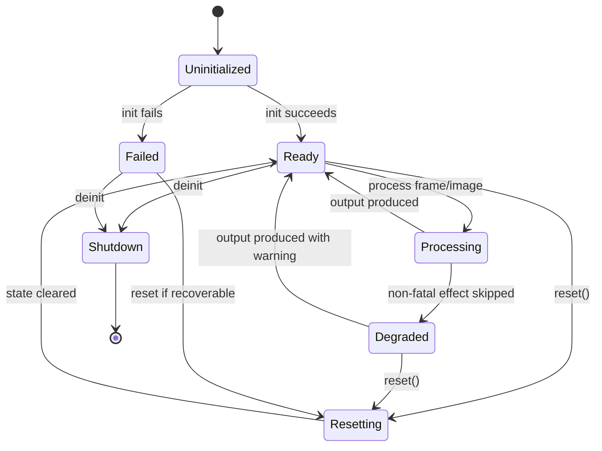
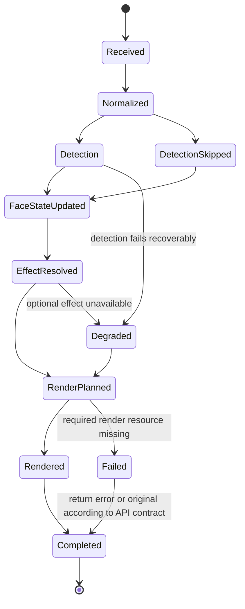
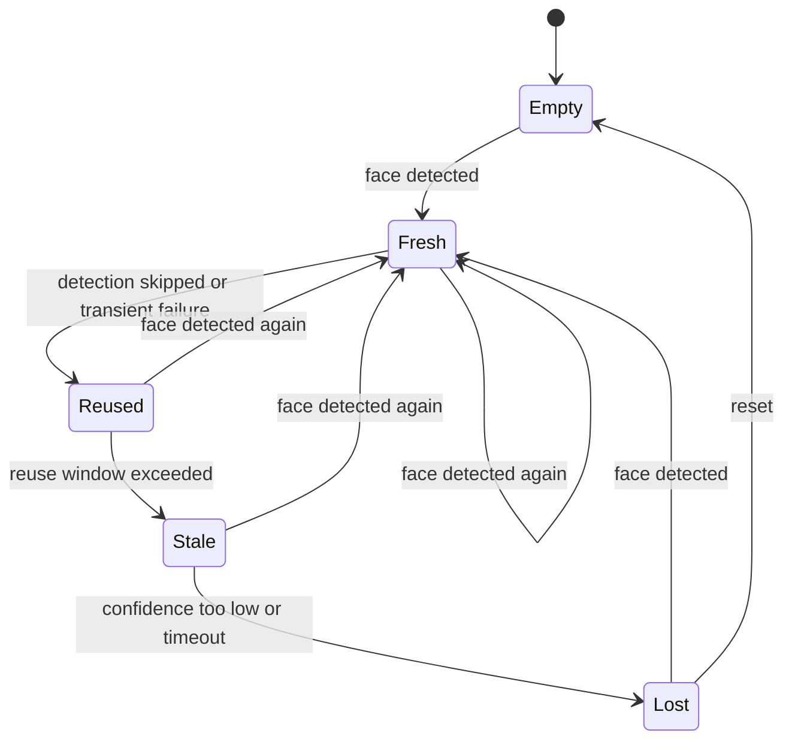

# DESIGN.md

> `beauty` 的核心设计契约。本文记录设计理念、数据结构决策和状态机。
> 包边界看 `ARCHITECTURE.md`，UI 规则看 `FRONTEND.md`，可靠性规则看 `RELIABILITY.md`。
>
> 带 Phase / milestone 标题的段落是当时的冻结证据；其中的 “current”、
> “future” 和数量只对该历史节点有效。无 Phase 限定的模型摘要与本文最后的
> post-v1.15 contract 才描述当前工作树。

## 1. 设计目标

`beauty` SDK 的核心体验是：宿主 App 传入图像帧与参数，SDK 以稳定、可预测、可实时运行的方式输出处理后的图像。

设计优先级：

1. 实时链路稳定。
2. 数据模型可序列化、可测试、可跨并发域传递。
3. 参数组合可控，不因叠加效果产生明显失真。
4. 渲染、检测、效果、资源彼此解耦。
5. 对外 API 简洁，内部实现可替换。

## 2. 设计原则

| 原则 | 约束 |
| --- | --- |
| Snapshot over shared mutation | 每帧处理读取不可变参数快照，避免跨线程共享可变状态。 |
| Zero means no effect | 所有强度参数默认值必须是无效果状态。 |
| Normalize at the boundary | App UI 的 0...100 或 -100...100 必须在进入 SDK 前归一化。 |
| Platform details stay internal | Vision、Metal、Core Image 的细节不泄漏到公共参数模型。 |
| Detection is optional per effect | 不依赖人脸的效果不得强制等待检测结果。 |
| Degrade before fail | 检测、资源、单个效果失败时优先降级输出原图或跳过该效果。 |
| Deterministic presets | 同一个预设、同一张图、同一版本 SDK 应产生可复现的参数快照。 |

## 3. 核心决策

| ID | Decision | Consequence |
| --- | --- | --- |
| D1 | 第一版 `BeautyEngine.process` 接收显式 `BeautyParameters`。 | Demo 自己管理滑杆状态；SDK 每帧使用传入快照。 |
| D2 | `BeautyParameters` 使用 `Float`，增强型为 `0.0...1.0`，双向型为 `-1.0...1.0`。 | UI 展示范围与内部算法范围解耦。 |
| D3 | SDK 内部统一使用图像归一化坐标。 | Vision、纹理、预览坐标全部通过 `CoordinateMapper` 转换。 |
| D4 | 人脸形变统一表示为 `[WarpControlPoint]`。 | 五官 Provider 可组合，最终由一个 `FaceWarpPass` 执行。 |
| D5 | 预设只生成参数，不直接操作渲染链路。 | 预设可以序列化、测试、导入导出。 |
| D6 | 渲染管线由 `RenderGraph` 组织。 | 效果顺序集中控制，避免每个功能私自插入 pass。 |
| D7 | 内部状态只能由 Engine 拥有或由专门状态对象隔离。 | 检测缓存、点位平滑、纹理缓存不会散落在 UI 层。 |
| D8 | `BeautyEngine.init` 使用 `throws`，`process` 第一版同步返回。 | 初始化失败可被 App 明确处理；实时调用必须在非主线程队列配合 in-flight 限制。 |

## 4. 公共数据模型

### 4.1 BeautyConfiguration

`BeautyConfiguration` 是 Engine 创建时的运行策略配置，不是逐帧输入状态，也不是美颜参数。

推荐字段：

| Field | Type | Meaning |
| --- | --- | --- |
| `preferredProcessingSize` | `CGSize?` | 期望处理尺寸；`nil` 表示由 SDK 按模式选择。 |
| `maximumFaceCount` | `Int` | 每帧最多处理的人脸数量。 |
| `enableFaceTracking` | `Bool` | 是否启用跨帧跟踪和平滑。 |
| `detectionFrameInterval` | `Int` | 检测降频间隔。 |
| `renderQuality` | `BeautyRenderQuality` | 性能与质量等级。 |
| `enablePerformanceLog` | `Bool` | 是否采样性能日志。 |
| `enableDebugMode` | `Bool` | 是否输出调试指标与中间信息。 |
| `logLevel` | `BeautyLogLevel` | SDK 日志等级；默认 release 使用 `error`。 |
| `maximumInputByteCount` | `Int` | 编码图像输入上限；默认 `33_554_432`（32 MiB）。 |
| `maximumInputPixelCount` | `Int` | 解码图像与像素缓冲区的像素数上限；默认 `50_000_000`。 |
| `renderBackend` | `BeautyRenderBackend` | 执行策略；精确为 `.cpu` 或 `.gpu`，默认 `.cpu`。 |

规则：

- 初始化后不可变。
- 必须满足 `Sendable`。
- 不能包含宿主 UI 框架或宿主 App 状态。
- 图像方向、输入镜像、预览镜像是逐帧输入状态，不放入全局 configuration。
- 两个输入上限都是尾部默认参数；非正自定义值回落到各自默认值，旧 JSON 缺少两个 key 时通过显式 `decodeIfPresent` 得到相同默认值。
- 上限是拒绝边界而非处理策略：精确命中上限继续当前行为，超过上限返回 `BeautyError.invalidInput`；SDK 不借此缩放、降采样或重解释 `preferredProcessingSize`。
- `renderBackend` 是执行策略而非逐帧美颜参数；新建配置和缺少该 key 的旧 Codable payload 都确定性解码为 `.cpu`。显式 `.gpu` 只经 `BeautyBackendFactory` 构造 package Metal backend；不可用时终止为 `.metalUnavailable`，不回退 CPU。配置初始化后不可变，package-only injection 仅用于测试。

### 4.2 BeautyParameters

`BeautyParameters` 是所有可调效果的唯一公共参数模型。当前模型包含精确 **61 个 stored fields = 60 个 numeric fields + `filterId`**，覆盖基础皮肤、基础颜色、脸型、眼睛、鼻子、嘴巴、眉毛、滤镜，以及尾部兼容追加的 `teethWhitening` 和 `scleraRednessReduction`。

最低协议：

```swift
public struct BeautyParameters: Codable, Equatable, Sendable
```

1.0 参数域：

| Domain | Fields | Range |
| --- | --- | --- |
| Skin | `skinSmoothing`, `skinWhitening`, `skinRosy`, `skinSharpen` | `0.0...1.0` |
| Color | `brightness`, `contrast`, `saturation`, `temperature`, `tint`, `exposure`, `highlight`, `shadow` | mixed |
| Face Shape | shipped `faceSlim`, `faceSmall`, `faceVShape`, `jawSlim`, `chinLength`; new `faceContourSmooth`, `templeFullness`, `cheekboneSlim`, `chinTaper` | shipped mixed; new `0...1` |
| Eyes | shipped `eyeSize`, `eyeTailLift`: `[0, 1]`; shipped `eyeDistance`, `eyeYPosition`: `[-1, 1]`; new `eyeHeight`, `eyeLength`, `upperEyelidLift`, `pupilSize`, `gazeCorrection`, `lowerEyelidDrop`, `innerCornerOpen`, `outerCornerOpen`, `eyeSymmetry`: `[0, 1]`; new `eyeTilt`: `[-1, 1]` | default-zero independent scalars; one signed new field |
| Nose | `noseSlim`, `noseWingSlim`, signed `noseTipSize`, `noseBridge`, `noseRootNarrowing`, `noseTipLift` | legacy mixed + new positive-only `0...1` |
| Mouth | `mouthSize`, `mouthWidth`, `smile`, `mouthYPosition`, `mouthTilt`, `mouthXPosition`, `lipPeakDefinition`, `lipPlump`, `lipColor` | mixed |
| Filter | `filterId`, `filterIntensity` | ID + `0.0...1.0` |

Phase 28 completion evidence covers the existing Face Shape fields only: `faceSlim` for `脸宽`, `faceSmall` for `小脸`, signed `chinLength` for `下巴长短`, `faceVShape` for `V脸`, and `jawSlim` for both `下颌角` and alias-backed `下颌线`. It does not add a new public parameter or change the `BeautyParameters` shape.

### Phase 30 Eye Safety Contract

- `eyeSize` and `eyeTailLift` are positive-only `[0, 1]`; negative finite values normalize to zero. Their exact effective caps are `0.45` and `0.30`.
- `eyeDistance` and `eyeYPosition` are signed `[-1, 1]`; both directions survive normalization and weakening. Their exact effective caps are `0.30` and `0.25`.
- `NaN`, positive infinity, and negative infinity normalize to zero for every eye field. Finite overflow clamps to the public range before effective caps apply.
- Eye geometry requires both eyes. Missing either eye group skips the entire eye domain and zeros all four eye strengths.
- Reused and stale eye geometry also skip the eye domain and zero all four strengths. This stricter freshness rule is eye-specific; it does not redefine non-eye reuse behavior.
- Evidence for exact caps, abnormal inputs, missing/reused/stale degradation, combined weakening, and active-source boundaries is recorded in `30-EYE-SAFETY-EVIDENCE.md`.

### Phase 32 Nose Safety Contract

- `noseSlim` and `noseWingSlim` are positive-only with exact effective cap `0.35`; `noseBridge` is positive-only with cap `0.30`.
- `noseTipSize` remains signed with exact effective cap `±0.30`; positive and negative directions survive normalization, weakening, provider planning, and renderer output.
- Missing required nose geometry and stale geometry skip the nose domain and zero all four effective nose strengths. Reused nose geometry follows the non-eye contract and retains the domain at `0.5` strength.
- Combined face/eye/mouth geometry weakens every nose field conservatively while preserving signed tip direction.
- Combined face/eye/nose geometry weakens `mouthSize`, `mouthWidth`, and `smile` conservatively while preserving signed mouth directions; `lipColor` is excluded because it is a color-domain effect.
- Evidence is recorded in `31-NOSE-RENDERER-EVIDENCE.md` and `32-NOSE-SAFETY-EVIDENCE.md`.

### Phase 35 Independent Nose Contract

- `noseRootNarrowing` and `noseTipLift` are independent positive-only public `Float` values in `0...1`; each defaults to `0`, finite overflow clamps to the public range, and every non-finite value becomes `0`. Neither aliases the four legacy nose fields.
- Both values have provisional effective cap `0.25`. Phase 36 owns output/ROI evidence and Phase 37 owns the final exact-cap calibration; Phase 35 does not call the provisional value final.
- `noseRootNarrowing` consumes only an explicit package-internal upper-root pair and produces symmetric horizontal inward motion with unchanged Y. `noseTipLift` consumes only an explicit lower-tip subset and produces upward vertical motion with unchanged X.
- `FaceGeometry.nose` remains the legacy proxy. Default-empty `noseRoot` / `noseTip` supports are validated for finiteness, bounds, provenance, symmetry/distinctness, and sufficient cardinality before output clamping; invalid support fails closed with no bridge or signed-tip fallback.
- Missing/stale aggregate nose geometry zeros all six nose fields. Reused non-eye geometry applies exact `0.5`; therefore each new field is `0.125` when entering reuse at its provisional cap. Fresh nose and mouth geometry is preflighted through provider-owned per-field emission results. Conflict weakening then converges through at most nine monotonic nose/mouth mask changes: any field that stops emitting at its scaled strength is removed from the unscaled baseline before total, count, and scale are recomputed. Final effective nose and mouth fields therefore exactly match final provider emissions. If all requested mouth fields are removed, the established aggregate `mouth_inputs_missing` skipped-domain path remains visible; an emitting mouth sibling keeps that domain active.
- Phase 35 command evidence is `35-VERIFICATION.md`; it keeps `山根`, `提升`, and branch-level `鼻子` unpromoted until Phases 36/37 complete their own output, safety, boundary, and promotion gates.

### Phase 37 Final Six-Field Nose Contract

- Phase 37 finalizes the independent `noseRootNarrowing` and `noseTipLift` effective caps at exact `0.25`; public inputs remain positive-only `0...1`, default/non-finite zero, and finite overflow is counted and reported only through aggregate capped evidence.
- The exact six-field set is `noseSlim`, `noseWingSlim`, signed `noseTipSize`, `noseBridge`, `noseRootNarrowing`, and `noseTipLift`. Zero/no-face/missing/stale input fails closed, reused eligible geometry applies exact `0.5`, and field-specific missing or provider-empty work is removed without borrowing a sibling's support.
- Provider eligibility and combined face/eye/mouth/nose convergence use one retained baseline. Removed work contributes zero times; final effective strengths, active domains, total, weakened count, scale, warning, and emitted vectors describe the same converged set while both signed tip directions remain intact.

### Phase 38 Remaining Mouth Geometry Contract

- `mouthYPosition`, `mouthTilt`, and `mouthXPosition` are independent signed `-1...1` public values; `lipPeakDefinition` and `lipPlump` are independent positive-only `0...1` values. All default and non-finite inputs normalize to zero, legacy 33-field payloads decode neutrally, and the Phase 38 inventory was exactly 38 stored fields.
- Phase 38 uses provisional effective caps of exact `0.25`. Y/X position translate the unchanged whole-mouth support on one axis, tilt rotates it around a stable mouth center, peak shapes explicit upper plus inner support, and plump thickens explicit upper/lower surfaces away from the inner opening.
- `MouthWarpProvider` owns eight geometry fields: shipped size/width/smile plus the five new controls. Provider preflight and post-conflict sanitization remove non-emitting work per field; combined nose/mouth convergence is monotonic and bounded at fourteen possible removals, so final strengths, totals, counts, scale, warnings, and emissions share one retained set.
- Reused eligible non-eye geometry scales by exact `0.5`; `lipColor` remains a separate color-domain effect. Phase 39 owns saved-output/ROI evidence and Phase 40 owns final cap calibration, exhaustive transitions, boundaries, and promotion.
- `37-NOSE-SAFETY-EVIDENCE.md` records fresh 103/103 focused and 228/228 full XCTest evidence plus unchanged 252/252 public-facade output. This closes only the exact SDK-core branch and does not establish Demo, device, commercial, packaging, shipping, or launch readiness.

### Phase 41 Public Eye Contract and Observed-Support Design

- The ten independent additions are positive-only `eyeHeight`, `eyeLength`, `upperEyelidLift`, `pupilSize`, `gazeCorrection`, `lowerEyelidDrop`, `innerCornerOpen`, `outerCornerOpen`, and `eyeSymmetry`, plus signed `eyeTilt`. Every value defaults to zero; missing legacy 38-key JSON values and non-finite values become zero. The current Codable inventory is exactly 48 stored fields: 47 numeric fields plus `filterId`.
- `BeautyObservedEyeSupport` carries anatomical left/right contours and optional pupils as package-only, `Sendable`, request-scoped evidence. Vision points cross `CoordinateMapper` exactly once into finite closed-unit image-normalized coordinates. No pupil is synthesized when Vision omits one.
- Before semantic support reaches the adapter, `VisionFaceDetector` requires exactly one anatomical `.left` and one `.right` contour. It maps the face-local horizontal basis through the same `CoordinateMapper` metadata, projects the mapped contour-center separation onto that axis, and accepts only a finite projection strictly greater than `0.000001`. Missing, duplicate, coincident, or side-inverted pairs are invalid; valid `.up`, `.right`, `.left`, `.down`, and input-mirrored observations preserve their original anatomical labels.
- `BeautyFaceGeometryAdapter` canonicalizes winding-independent semantic upper/lower/inner/outer/corner/center support. Its package-private `span` is the image-normalized contour bounding width/height, and signed `tilt` is `atan2(inner.y - outer.y, abs(inner.x - outer.x)) / (pi / 2)` clamped to `-1...1`; reversed or cyclic winding does not change either value. Contours accept 6...16 input points, at least 4 unique points, relative width `0.04...0.50`, height `0.01...0.30`, and bounding area above `0.0004`. Pupils use 10% expanded containment, normalized ellipse offset at most `0.70`, and paired contour width/height ratios `0.50...2.00`. These are support-validation ceilings, not final visual-effect caps.
- An invalid/absent pupil disables only `pupilSize` and `gazeCorrection`; valid contour siblings remain eligible. An explicit observed payload with either side absent or invalid leaves that `FaceGeometry` eye side empty and never borrows the legacy proxy. The existing resolver complete-eye gate then skips the whole eye domain. A nil observed payload retains the legacy proxy only for shipped zero-default compatibility.
- Raw and derived support stays non-public, non-Codable, ephemeral, and absent from logs, warnings, errors, descriptions, metrics, snapshots, persistence, and Demo imports. Phase 41 adds no provider transforms, final caps, facade output, renderer/gallery evidence, promotion, Demo behavior, device/commercial evidence, packaging, shipping, or launch-readiness claim.

### Phase 45 Public Face Contract and Observed-Support Design

- The four independent additions are positive-only `faceContourSmooth`, `templeFullness`, `cheekboneSlim`, and `chinTaper`. Each public `Float` defaults to zero, clamps finite input to `0...1`, maps non-finite input to zero, and round-trips independently. Signed `chinLength` remains unchanged. The exact current Codable inventory is **52 stored fields: 51 numeric fields plus `filterId`**; legacy 48-key payloads and the unchanged five bundled presets decode all four missing keys as zero.
- `BeautyObservedFaceSupport` carries actual Apple Vision `faceContour` and `medianLine` values as independently optional, package-only, immutable `Sendable` request evidence. The existing single landmarks request copies only coordinate values, preflights contour and median at fixed ceilings of 32 and 16 points, composes accepted face-local values through one request-local `CoordinateMapper`, and maps each accepted point exactly once.
- Canonical contour traversal follows the mapper-derived face-local right axis and canonical median direction follows its down axis. Canonicalization may reverse the whole open path only; it never sorts points or changes adjacency. The same input orientation and mirror metadata drives points and axes, while preview mirroring does not alter image-normalized support.
- Adapter validation is face-specific. Contour accepts 7...32 exact-bit-unique finite closed-unit points, relative width `0.50...1.00`, relative height `0.20...1.00`, endpoint horizontal separation at least `0.35`, and chord-perpendicular curvature at least `0.10`. Median accepts 3...16 such points, net-down projection at least `0.25`, and direction magnitude at least `0.000001`. Complete centerline eligibility additionally requires median-bottom chord position `0.15...0.85`, nearest-apex distance at most `0.40`, and at least two contour points on each apex side. These are inclusive support-validation bounds, not visual-strength caps.
- `FaceGeometry.observedFaceSupport` is attached beside, and never substituted for, the exact seven-point synthetic `FaceGeometry.faceContour` compatibility proxy. A valid contour can remain contour-eligible when median or cross-support validation fails; invalid contour produces no observed semantic support. Existing face, eye, nose, and lip geometry remains unchanged.
- Phase 45 stops at public storage and private support eligibility. None of the four new fields enters `requiresFaceGeometry`, effective strengths, safety caps, providers, conflict accounting, facade routing, renderer output, Demo behavior, or feature-ledger promotion. Phase 46 and later phases own those downstream contracts.

### Phase 49 Public Eyebrow Contract and Observed-Support Design

- The seven independent additions are signed `eyebrowYPosition`, `eyebrowThickness`, `eyebrowLength`, `eyebrowSpacing`, `eyebrowHeadSpacing`, and `eyebrowTilt` in `-1...1`, plus positive-only `eyebrowPeakDefinition` in `0...1`. Every value defaults to zero, finite overflow clamps to its range, and non-finite input normalizes to zero. The Phase 49 snapshot was **59 stored fields: 58 numeric fields plus `filterId`**; the current inventory is the 61-field model above. Complete unequal values round-trip and compare independently; reset, snapshot diff, and non-mutating normalization include all seven. Removing the seven keys reconstructs the compatible legacy 52-key payload, and the unchanged five bundled presets decode seven zeros; historical 31/33/38/48/52 counts remain historical fixtures.
- `VisionFaceDetector` copies actual Apple Vision `leftEyebrow` and `rightEyebrow` coordinate values from the existing selected-face landmarks request. Each side is independently preflighted as a non-empty open path with at most 16 points before mapping; rejected sides map zero eyebrow points. Accepted points pass the request-local `CoordinateMapper` exactly once, with four fixed face-axis probes used only to derive mapper-consistent right/down axes.
- Anatomical side is decided from the mapped side centroid on the mapper-derived right axis. Phase 51 actual-image integration established that Apple Vision may return the open eyebrow region with both raw endpoints at the same anatomical end of its thick outline, so endpoint reversal alone is not an inner-to-outer centerline contract. After exactly-once mapping, accepted samples are therefore stably ordered by face-right-axis projection (left and right use opposite anatomical direction; projection ties retain provider order) before adapter validation. This preserves the exact mapped sample multiset without closing, remapping, retrying, or inferring polygon winding. Screen-axis sorting, eye contours, historical eye geometry, generated traces, and the synthetic face proxy remain prohibited as eyebrow evidence.
- `BeautyFaceGeometryAdapter` validates each canonical side independently as an exact-bit-unique finite closed-unit open path with **4...16** points, face-relative endpoint chord **0.08...0.50**, vertical span at most **0.25**, no non-adjacent segment intersection, and projection epsilon **0.000001**. A semantic trace preserves exact canonical points, inner/outer endpoints, arithmetic center, and only a unique interior apex above epsilon; apex is optional and not Phase 49 provider eligibility. `BeautyEyebrowSemanticSupport.left/right` remain independent optionals and `pairEligible` is true only when both distinct sides survive.
- Raw `BeautyObservedEyebrowSupport` and derived `BeautyEyebrowSemanticSupport` are immutable, package/internal, non-Codable, request-scoped values attached as `observedEyebrowSupport` on the observation and `FaceGeometry`. Phase 49 keeps every new scalar inert: no face-geometry trigger, effective strength, provider, resolver/conflict case, facade route, render/output/gallery case, Demo/UI behavior, or row promotion exists. Phase 50 owns provider and routing behavior; Phases 51-52 own output and safety/promotion.

### Phase 50 Independent Eyebrow Geometry Contract

- The seven same-named effective strengths use provisional cap `0.25` once: signed `eyebrowYPosition`, `eyebrowThickness`, `eyebrowLength`, `eyebrowSpacing`, `eyebrowHeadSpacing`, and `eyebrowTilt`, plus positive-only `eyebrowPeakDefinition`. The provisional eyebrow subtotal is `1.75`; Phase 52, not this contract, owns final calibration.
- Vertical translates every point of each eligible side by face-height `0.025`; thickness emits balanced normal-strip pairs from base half-width `0.012` with change `0.006`, skipping only a sample whose adjacent-span tangent is degenerate while retaining other finite pairs from that side; length moves the final two canonical outer samples with weights `0.5/1` by face-width `0.025`. Their radii are respectively face-width `0.08`, `0.055`, and `0.07`, with falloff `2`.
- Whole spacing requires two distinct eligible sides and translates their complete traces equally/oppositely on the center axis by face-width `0.025`. Head spacing is per-side, uses only the first two inner samples with weights `1/0.5`, and displacement `0.020`. Their radii are `0.08` and `0.06`; thus pair spacing and head spacing cannot alias.
- Tilt is per-side, requires a finite nondegenerate canonical chord, rotates non-center samples around the stored center by provisional angle `0.12`, and uses radius `0.075`. Positive sign follows the existing image-Y convention and raises canonical outer tails. Peak is positive-only, requires the stored unique interior apex and nondegenerate chord-to-apex normal, uses apex-neighbor weights `0.5/1/0.5`, face-height displacement `0.012`, and radius `0.055`. No midpoint/extremum fallback exists.
- All constants above are provisional Phase 50 choices. Inputs, derived vectors, radii, strengths, sources, and targets must be finite and bounded before control-point creation; epsilon is `0.000001`. Empty named arrays sanitize only their same-named strength. Per-side fields survive a missing sibling, while whole spacing alone requires the pair.
- Exact convergence owns one 44-name monotone retained baseline: face/chin `3.35` + eye `4.10` + eyebrow `1.75` + nose `1.80` + mouth `2.45` = provisional `13.45`. At the threshold, one shared scale `1 / 13.45` preserves polarity, no removed field re-enters, and final named emissions are the sole source for active domains, warning/metric counts, total geometry points, and the one stable dispatch.
- Fresh Phase 50 tests prove these mechanics and request isolation only. Phase 51 owns decoded visibility, direction, locality, distinction, ROI, and gallery evidence; Phase 52 owns final caps, exhaustive transitions, naturalness/safety conclusions, and row/branch promotion. No v1.14-v1.16 or UI/device/commercial/release behavior is implied.

### Phase 51 Eyebrow Output Evidence Contract

- Phase 51 exercises thirteen provisional public cases: signed `±0.25` pairs for vertical position, thickness, length, whole spacing, head spacing, and tilt, plus positive-only `0.25` peak definition. These are evidence inputs, not final effective-cap decisions; Phase 52 owns cap calibration and any product promotion.
- Strict evaluation uses the fixed `e6` brow ROI `(0.24, 0.76, 0.24, 0.43)` and separately fixed protected eye, forehead/hair, background, and watermark regions. Six signed predicates require opposite directed behavior; seven-family comparisons require vertical, thickness, length, whole spacing, head spacing, tilt, and peak to remain semantically distinct, including whole spacing versus head spacing and thickness versus peak.
- Acceptance combines frozen non-circular pixel thresholds with original-detail review of the baseline and thirteen actual eyebrow images. Output evidence proves visible, brow-local, directed, distinct behavior for this fixture; it does not establish naturalness extrema, exhaustive transition safety, device parity, or final caps.

### Phase 53 Canonical Still-Image Carrier Contract

- D-05/D-17 uses exactly one package-only `BeautyCanonicalStillImage` value in `BeautyCore`; no target or reversed dependency is added. The immutable carrier owns one RGBA8 `Data` backing plus exact positive `width`, `height`, and `rowBytes`, and checked multiplication requires `rowBytes == width * 4` and `data.count == rowBytes * height` before a view exists.
- The carrier accepts only normalized `.up`, not-input-mirrored metadata and opaque bytes. Its zero-origin `CIImage` view is created directly over the same owned data using `.RGBA8` and an explicit sRGB color space. It is non-Codable, has no exported/SPI byte or diagnostic representation, and keeps canonical pixels request-owned.
- A temporary clang module cache allows the carrier-focused SwiftPM test to pass 6/6; the production validate/orient/color-manage boundary remains owned by Plan 53-02 Task 2.
- D-09 through D-12/D-17 extend the existing Detection carriers in place with package-only immutable non-Codable `BeautyObservedLipSupport`. Actual `outerLips` and `innerLips` values are copied from the existing single `VNDetectFaceLandmarksRequest`, independently preflighted at `1...32` finite face-local normalized points, and mapped once through the existing request-local `CoordinateMapper`; neither region is synthesized from `FaceGeometry` or a face box.
- Outer and inner absence or rejection is region-local. A malformed, oversized, empty, non-finite, or out-of-unit region maps zero points without erasing its valid lip sibling, the selected face, or other eye/brow/face support. Provider and selection order stay stable, with no sorting, retry, cache, second request, or stored engine support.
- `VisionDetectionObservation`, `BeautyFaceObservation`, and `BeautyObservedLipSupport` descriptions, debug descriptions, dumps, and mirrors expose only outer/inner aggregate counts. The support remains package-only and request-local; no public/SPI unexported geometry, provider, renderer route, parameter field, or realtime/pixel-buffer behavior is added.
- `BeautyLocalRetouchAdmission` is the sole Phase 53 admission value and its production inventory is exact-empty. The testing seam supplies only a nonnegative opaque demand count: zero follows the unchanged legacy route, while any positive count collapses to one request rather than multiplying canonicalization, Vision, mapping, context, or render work.
- `BeautyStillImageRequestContext` is immutable, package-only, non-Codable, and stack-local. It owns the one canonical carrier and current selected mapped observation, exposes only selected-face and lip-point counts through its redacted description, and is destroyed before the facade returns or throws. Valid-invalid-valid, no-face, missing-support, reset, and independent-engine tests prohibit support reuse without claiming same-engine parallel safety.
- The admitted order is exact: cheap input/resource validation → canonicalize → existing detect/map → create request context → render. Missing face/support removes only local evidence and preserves unrelated shipped color work; canonical or injected malformed-request failure stops before context/render. Phase 55 retains original-pixel mask composition and overlap ownership.
- D-05/D-08 completes that handoff through a package-only `BeautyColorEffectPipeline` overload that accepts the `BeautyCanonicalStillImage` carrier rather than a caller image. The detector receives the carrier's exact `CIImage` view, and the renderer receives the same carrier/backing; any admitted geometry rasterization uses explicitly named sRGB working, output, bitmap, and reconstructed-image color spaces. The legacy `CIImage` overload retains its device-RGB behavior and remains the only no-admission route.
- D-13 keeps production admission exact-empty and locks the inactive result as exact input dimensions/RGBA bytes, empty warnings, exact zero active/capped metrics, and `.notRun` detection summary. This handoff adds no candidate field, local provider, mask, overlap rule, original-pixel transform, or renderer case; Phase 55 remains the sole owner of original-pixel mask composition and overlap failure.
- D-14/D-15 closeout locks the exact 59 stored/CodingKey inventory (58 numeric plus `filterId`), neutral defaults and missing-key decoding, legacy labeled construction, five preset IDs and source hashes, the 72-case renderer inventory, and the executable trailing-append admission checklist. Phase 53 still contains no candidate field, CodingKey, preset key, provider, renderer case, or inert production route.

Rules:

- `0` means no effect for numeric parameters unless the field is explicitly bidirectional.
- `nil` resource ID means no resource-backed effect.
- All setters or initializers must clamp invalid values before rendering.
- `process` must not mutate the caller's parameter value.
- Adding a public parameter requires updating this file and `PRODUCT_SENSE.md` acceptance criteria.
- Complete makeup, background segmentation, body shape, teeth whitening, and remaining advanced retouch parameters are post-1.0 extensions; Phase 50 eyebrow values have provisional SDK-core provider/routing behavior only.

### 4.3 BeautyPreset

`BeautyPreset` is a named, versioned parameter bundle.

Recommended shape:

```swift
public struct BeautyPreset: Codable, Equatable, Sendable {
    public let id: String
    public let version: Int
    public let displayName: String
    public let parameters: BeautyParameters
}
```

Rules:

- Applying a preset returns a complete `BeautyParameters` value.
- Presets must not contain hidden code paths.
- Bundled preset JSON uses `schemaVersion: 1`; legacy host preset JSON without `schemaVersion` remains accepted for source compatibility.
- Invalid preset values are rejected or clamped before they reach rendering.
- `filterId` values are data references and must be present in the resolved resource registry before parameters are applied.
- User custom presets are product data; validation belongs to `SECURITY.md`.

### 4.4 BeautyFrame

`BeautyFrame` is the internal representation of input media.

Required meaning:

| Field | Meaning |
| --- | --- |
| `pixelBuffer` or image backing | Source image data without UIKit image objects in realtime paths. |
| `orientation` | Original capture or asset orientation. |
| `isInputMirrored` | Whether capture data has already been mirrored when SDK interprets coordinates. |
| `isPreviewMirrored` | Whether preview display mirrors the final image; used for overlay and future API extension. |
| `timestamp` | Frame time for smoothing and metrics. |
| `source` | Camera, photo, video, export, or test fixture. |
| `extent` | Pixel size used for coordinate mapping. |

Rules:

- Realtime camera frames must not be retained longer than needed.
- Long-running pipelines must copy or convert frame data into owned buffers.
- Orientation must be normalized before detection and rendering agree on coordinates.
- First public API may expose only `CGImagePropertyOrientation`, but internal frame design must leave room for mirror flags.

### 4.5 BeautyResult

`BeautyResult` is the result envelope for processed media. Public facade APIs may return a typed `BeautyResult<Output>` when callers need detection/degradation metadata in addition to the processed output.

Recommended fields:

| Field | Meaning |
| --- | --- |
| `output` | Processed pixel buffer, texture-backed image, or CI image. |
| `faces` | Face observations actually used by this frame. |
| `detectionSummary` | Public, geometry-free summary of detection availability and degradation. |
| `warnings` | Non-fatal degradation notes. |
| `metrics` | Timings and pass-level counters when debug is enabled. |

Rules:

- Public compatibility APIs may expose only the processed output, but metadata-aware APIs must preserve `BeautyInputMetadata` and `BeautyDetectionSummary`.
- Warnings must not be logged as fatal errors.
- Metrics and summaries must not include biometric or personally identifying image data, bounding boxes, landmark coordinates, raw Vision objects, raw framework errors, or local file paths.
- `BeautyResult<Output>` has conditional `Sendable` conformance only when
  `Output: Sendable`. This preserves ordinary `BeautyResult(output:)`
  construction for framework-backed non-sendable outputs without promising that
  arbitrary caller payloads can cross concurrency domains.
- Public `BeautyResultConcurrencyTests` compile a concrete sendable result,
  transfer it through an async task boundary, and assert all public fields;
  the boundary self-test owns the negative unconditional-declaration guard.

### 4.6 BeautyInputMetadata

`BeautyInputMetadata` is the public per-input context passed with camera frames and still images.

Required fields:

| Field | Meaning |
| --- | --- |
| `orientation` | `CGImagePropertyOrientation` for capture or image asset normalization. |
| `isInputMirrored` | Whether the source pixels are already mirrored before SDK coordinate interpretation. |
| `isPreviewMirrored` | Whether the Demo/host preview mirrors the displayed result. |
| `source` | Camera, photo, video, export, or test fixture. |
| `timestamp` | Optional frame timestamp for smoothing and diagnostics. |

Rules:

- Orientation, input mirroring, and preview mirroring are explicit metadata, not inferred from UI state.
- Metadata travels with the frame/image into `BeautyEngine.processResult(...)`.
- Preview mirroring does not change the canonical detection model; it only affects display/overlay mapping.

### 4.7 BeautyDetectionSummary

`BeautyDetectionSummary` is the public, geometry-free detection state attached to metadata-aware results.

Allowed public fields:

| Field | Meaning |
| --- | --- |
| `availability` | `notRun`, `disabled`, `noFace`, `usable`, `partial`, `lowConfidence`, `skipped`, `reused`, or `stale`. |
| `reasons` | Redacted reason codes such as no face, missing landmarks, face limit, mapping failure, or stale detection. |
| `faceCount`, `usedFaceCount` | Counts only, never face identity or location. |
| `detectionDurationMs`, `mappingDurationMs` | Optional timing values. |

Rules:

- The summary must not expose points, rects, bounding boxes, landmark coordinates, `VNFaceObservation`, raw framework errors, or local image paths.
- `.mappingFailed` is a degraded state; output should still be possible when rendering can safely skip face-dependent work.
- `.disabled` and `.notRun` are valid non-error states for configuration or first-version no-op paths.
- Phase 26 still-image processing uses `.notRun` when parameters do not require geometry and `.disabled` when tracking/detection is disabled; geometry-triggered unusable detection maps to redacted `noFace`, `lowConfidence`, `partial`, or failure reason summaries while face-agnostic effects may continue.
- Phase 27 still-image geometry output keeps this summary model unchanged: selected-face render data stays internal, and saved-output evidence is recorded through renderer/helper counts, dimensions, warnings, and aggregate metrics only.

## 5. Detection Models

### 5.1 BeautyFaceObservation

Internal face observation after platform-specific mapping.

Required fields:

| Field | Meaning |
| --- | --- |
| `id` | Stable tracking identifier while the face remains continuous. |
| `boundingBox` | Image-normalized bounding box. |
| `landmarks` | Mapped SDK landmark model. |
| `roll`, `yaw` | Optional pose values. |
| `confidence` | Detector confidence after normalization. |
| `trackingState` | Fresh, reused, stale, or lost. |

Rules:

- `VNFaceObservation` must not cross the `BeautyDetection` boundary.
- Low-confidence faces can be used for light color effects but not strong geometry.
- Face ordering must be deterministic, usually largest face first then stable ID.
- Phase 26 selects the first usable package-only detection observation for still-image geometry planning and does not expose raw observation data outside SDK internals.
- Phase 41 optionally attaches package-only observed left/right eye contour and pupil evidence after the single coordinate-mapping boundary. This evidence is consumed within the same request path and is never serialized, diagnosed, persisted, or exposed through the facade.

### 5.2 BeautyFaceLandmarks

Landmarks are grouped by semantic facial region.

Recommended groups:

```text
faceContour
leftEye
rightEye
leftEyebrow
rightEyebrow
nose
noseCrest
outerLips
innerLips
leftPupil
rightPupil
```

Rules:

- Missing landmark groups must be explicit, not represented as empty valid groups.
- Effect providers must declare required landmark groups.
- Landmark smoothing updates the internal state only after coordinate normalization.

### 5.3 FaceTrackingState

```text
fresh       detected on the current frame
reused      reused from a recent frame because detection was skipped or failed
stale       reused beyond the ideal window; only safe for weak effects
lost        no reliable face is available
```

Rules:

- Reuse window for first version: 1 to 3 frames.
- A face in `stale` state must disable strong geometry.
- A `lost` face clears smoothing state and geometry control points.

## 6. Coordinate Model

SDK internal coordinate space:

```text
ImageNormalized
origin: top-left
x: 0.0 left, 1.0 right
y: 0.0 top, 1.0 bottom
```

Coordinate spaces that must remain explicit:

| Space | Owner | Notes |
| --- | --- | --- |
| `VisionNormalized` | `BeautyDetection` | Vision-specific origin and orientation. |
| `ImagePixel` | `BeautyCore` / `BeautyRender` | Pixel dimensions after orientation handling. |
| `ImageNormalized` | `BeautyCore` | Canonical SDK model. |
| `TextureUV` | `BeautyRender` | GPU texture sampling coordinate. |
| `Preview` | historical host material | display coordinate owned by a host, not by the SDK package. |
| `MirroredPreview` | `BeautyDemo` | Front camera display coordinate. |

Rules:

- No ad hoc coordinate math in effects or UI.
- All conversions go through `CoordinateMapper`.
- Every conversion must include orientation and mirroring inputs.
- The current implementation maps Vision-normalized detector rectangles into canonical `ImageNormalized` bounds before face selection and effect planning.
- Input mirroring and preview mirroring are separate inputs; preview mirroring must not mutate stored face observations.
- Coordinate tests must cover front/back camera, portrait/landscape, and image EXIF orientation.

## 7. Geometry Model

### 7.1 WarpControlPoint

All face geometry effects produce control points:

```swift
public struct WarpControlPoint: Sendable {
    public let source: SIMD2<Float>
    public let target: SIMD2<Float>
    public let radius: Float
    public let strength: Float
    public let falloff: Float
}
```

Field rules:

| Field | Rule |
| --- | --- |
| `source` | Image-normalized position before deformation. |
| `target` | Image-normalized target position after deformation. |
| `radius` | Image-normalized influence radius, clamped to safe bounds. |
| `strength` | Effective contribution after parameter and safety limits. |
| `falloff` | Curve selector or scalar understood by `FaceWarpPass`. |

### 7.2 WarpControlPointProvider

Providers translate one feature domain into control points.

```swift
public protocol WarpControlPointProvider {
    func makeControlPoints(
        face: BeautyFaceObservation,
        parameters: BeautyParameters,
        imageSize: CGSize
    ) -> [WarpControlPoint]
}
```

Provider rules:

- Providers are pure functions of face, parameter snapshot, and image size.
- Providers do not allocate Metal resources.
- Providers return an empty array when required landmarks are unavailable.
- Provider order must be deterministic.
- Conflict resolution happens before points enter `FaceWarpPass`.

### 7.3 Geometry Conflict Policy

When multiple parameters move nearby facial regions:

1. Clamp each parameter to its safe effective range.
2. Generate candidate control points.
3. Merge points with compatible source regions.
4. Reduce strength when overlapping radii exceed safety limits.
5. Skip the weakest optional control point if the result is unstable.

This policy is part of visual correctness and must be tested with fixed faces and fixed parameter sets.

## 8. Effect Model

Effects are internal units that contribute to a render plan.

Recommended conceptual protocol:

```swift
protocol BeautyEffect {
    var id: String { get }
    var requirements: EffectRequirements { get }
    func resolve(context: BeautyEffectContext) throws -> EffectPlan
}
```

Effect categories:

| Category | Requires Face | Typical Pass |
| --- | --- | --- |
| Face geometry | yes | `FaceWarpPass` |
| Skin beauty | usually yes, may degrade to full image | `SkinPass` |
| Color adjustment | no | `ColorPass` |
| LUT filter | no | `LUTPass` |
| Makeup | yes + resources | `MakeupPass` |
| Segmentation | person mask | `SegmentationPass` |

Rules:

- An effect must declare whether missing detection disables it or downgrades it.
- An effect must not read UI state directly.
- Resource-backed effects must receive resolved resource handles, not raw paths.
- Pass order is owned by `RenderGraph`, not individual effects.
- Phase 6 current implementation resolves skin, color, filter, face-shape, eyes, nose, mouth, and lip-color domains through `BeautyEffectResolver` before rendering.
- Default `BeautyParameters()` resolves to no active visual output beyond copy/render tolerance.
- Color and metadata filters are face-agnostic and may continue when no usable face exists.
- Skin, face shape, eyes, nose, mouth, and lip color are face-dependent in Phase 6 no-face routing; they skip with redacted warning/metric evidence when `faceGeometry` is explicitly unavailable.
- Missing landmark groups skip only their dependent domains: eyes require eye groups, nose requires nose, and mouth/lip require outer lips.
- Mouth safety caps are exact: `mouthSize ±0.35`, `mouthWidth ±0.35`, `smile 0.50`, and `lipColor 0.50`. Reused mouth geometry scales the three geometry fields by exactly `0.5`; stale mouth geometry zeros them. Fresh mouth geometry uses one provider-owned per-field emission contract before and after shared conflict weakening, so a signed field scaled below its emission threshold becomes exact zero and is excluded from recomputed conflict evidence while supported siblings continue. With outer lips present, stale/reused `lipColor` remains unscaled as an independent color-domain operation.
- Reused landmarks reduce effective geometry briefly; stale landmarks skip strong geometry and record stable warning/metric evidence.
- Phase 26 adds `BeautyEffectResolver.requiresFaceGeometry(parameters:)` as the still-image detection trigger. `BeautyEffectResolver.resolve(parameters:selectedFaceObservation:)` converts one selected package-only detection observation into internal `FaceGeometry`; nil, no-face, low-confidence, and missing landmark groups degrade through the same redacted warnings and aggregate metrics as existing resolver contexts.
- Phase 27 routes that selected-face result into the still-image render path for same-dimension geometry output evidence. The current image path uses deterministic internal CIImage local warp after color/lip work when internal geometry points exist; no public parameter, public result field, or Demo dependency changes.
- Phase 28 records per-tool face-shape renderer evidence through existing parameters, focused resolver/provider tests, and a post-v1.5 spatial regression that proves control points move local pixels without changing unaffected pixels. `下颌线` remains a `jawSlim` alias, so the design contract stays one `jawSlim` field rather than splitting jaw angle and jawline behavior in v1.5.

## 9. RenderGraph Design

First stable order:

```text
Input
→ FaceWarpPass
→ SkinPass
→ ColorPass
→ LUTPass
→ Output
```

Design rules:

- `FaceWarpPass` consumes merged `[WarpControlPoint]`.
- `FaceWarpPass` uses the unified geometry shader `Warp.metal`.
- `SkinPass` runs after geometry so skin treatment follows final face shape.
- `ColorPass` runs before LUT so LUT can define final style.
- `LUTPass` is late because it is a look transform.
- Empty or zero-strength passes are skipped.
- Passes must declare input texture, output texture, uniforms, and recovery behavior.

Future pass insertion points:

| Future Capability | Insert After | Notes |
| --- | --- | --- |
| Makeup | `SkinPass` | Makeup should sit on corrected skin but before final color style. |
| Background segmentation | `FaceWarpPass` or before output | Depends on mask source and desired look. |
| Body warp | Before `FaceWarpPass` or combined geometry stage | Requires separate safety design. |
| Export-only enhancement | Before output | Can be slower than realtime preview. |

## 10. Engine Lifecycle State Machine



State rules:

| State | Meaning | Allowed Work |
| --- | --- | --- |
| `Uninitialized` | Engine resources are not ready. | Create configuration, allocate required contexts. |
| `Ready` | Engine can accept work. | Process frames, process images, reset. |
| `Processing` | One frame or image is being processed. | Read snapshots, update internal caches through isolation. |
| `Degraded` | Output is possible with skipped or weakened work. | Return output with warning and metrics. |
| `Failed` | Required dependency unavailable or unrecoverable error. | Report error, allow reset only when marked recoverable. |
| `Resetting` | Internal caches are being cleared. | Clear detection, smoothing, texture, resource transient state. |
| `Shutdown` | Engine is no longer usable. | Release resources. |

The public API does not need to expose every internal state, but tests should be able to verify transitions through behavior.

## 11. Frame Processing State Machine



Per-frame invariants:

- Parameter snapshot is captured once per frame.
- Detection result used for rendering is recorded in the result metadata.
- A skipped detection frame can reuse recent landmarks only within the allowed reuse window.
- Render pass list is derived after detection state is known.
- A frame never mutates global public parameters.
- Phase 26 applies this ordering to public still-image `BeautyEngine.processResult(image:metadata:parameters:)` for geometry-triggering parameters; pixel-buffer realtime behavior remains unchanged by that phase.
- Phase 27 extends the still-image ordering so selected usable geometry can affect the returned image while no-face and missing inputs degrade through the existing warnings/metrics path.

## 12. Parameter State Machine

```mermaid
stateDiagram-v2
    [*] --> Default
    Default --> Edited: user changes a value
    Edited --> Normalized: clamp and normalize
    Normalized --> Snapshot: process captures parameters
    Snapshot --> Rendered: frame completes
    Edited --> PresetApplied: apply preset
    PresetApplied --> Normalized
    Edited --> Reset: reset to defaults
    Reset --> Default
```

Rules:

- App or API boundary owns editing.
- SDK owns normalization validation before render.
- `Snapshot` values are immutable.
- Preset application must be deterministic and testable.

## 13. Detection State Machine



Rules:

- `Fresh` landmarks can drive all eligible effects.
- `Reused` landmarks can drive moderate geometry and skin effects.
- `Stale` landmarks can drive only weak or non-geometric effects.
- `Lost` disables face-dependent effects.
- `reset()` clears all smoothing and tracking state.
- Public summaries map these internal states to safe availability values: `usable`, `skipped`, `reused`, `stale`, `noFace`, `partial`, `lowConfidence`, `disabled`, and `notRun`.

## 14. Error and Degradation Design

Error categories:

| Category | Example | Default Behavior |
| --- | --- | --- |
| Configuration | Metal unavailable, invalid quality level | Throw during init. |
| Input | Invalid pixel buffer, unsupported format | Throw or return failed result. |
| Detection | Vision transient failure | Reuse recent face or skip face effects. |
| Resource | Missing LUT or makeup package | Skip resource-backed effect with warning. |
| Render | Texture creation or command buffer failure | Throw; do not silently corrupt output. |

Degradation must be explicit:

- Return original image only when API contract allows fallback.
- Attach warning metadata when output is degraded.
- Log internal detail according to `RELIABILITY.md`.
- Do not hide repeated failures that affect visible output.
- Phase 6 cap, skip, stale, reused, and combined-weakening events are carried through `BeautyResult.warnings` and numeric `metrics` using stable redacted keys; they must not add normal UI banners by themselves.

## 15. Concurrency Design

Concurrency ownership:

| State | Owner |
| --- | --- |
| UI sliders and selected preset | Host App / `BeautyDemo` |
| Active parameter snapshot | Captured by `BeautyEngine` per frame |
| Detection smoothing state | `BeautyDetection` under Engine isolation |
| Texture cache and command queue | `BeautyRender` |
| Resource cache | `BeautyResources` |
| Metrics aggregation | Engine or dedicated metrics collector |

Rules:

- Public value models should be `Sendable`.
- Do not use `@unchecked Sendable` for mutable reference types without a written isolation rule.
- Generic result envelopes may claim `Sendable` only when their output contract makes cross-domain transfer safe. `BeautyResult<Output>` therefore uses the public conditional declaration `extension BeautyResult: Sendable where Output: Sendable {}`; an unconditional generic or arbitrary-payload unchecked conformance is rejected by the SDK-only boundary self-test.
- Main actor is only for UI state.
- Detection may run on a detection queue or task.
- Metal encoding runs on the render queue chosen by `BeautyRender`.
- Realtime processing must avoid blocking the main thread.
- Synchronous `process(pixelBuffer:)` does not permit unbounded GPU waiting in realtime paths; callers must use a camera queue, bounded in-flight frames, and a drop-or-fallback policy.

## 16. Serialization Design

Codable models:

| Model | Purpose |
| --- | --- |
| `BeautyParameters` | Save user adjustments and import/export parameter sets. |
| `BeautyPreset` | Built-in and custom preset definitions. |
| `BeautyResourceManifest` | Resource package schema, version, minimum SDK, metadata filters, and preset references. |

Rules:

- Serialized JSON must include schema version for presets and resource manifests.
- Unknown fields should be ignored only when forward-compatible.
- Invalid parameter values are clamped or rejected before render.
- Resource IDs are data references, not executable behavior.
- Phase 5 filters are metadata-only IDs: `soft_clean` and `warm_light`; real LUT/color-pass assets remain future render scope.

## 17. Testable Design Contracts

Each implementation must make these contracts testable:

| Contract | Test Type |
| --- | --- |
| Default `BeautyParameters` produces no visible effect beyond copy/render tolerance. | Render fixture test |
| Parameter normalization clamps invalid values. | Unit test |
| Preset application returns deterministic parameters. | Unit test |
| Coordinate mapping handles orientation and mirroring. | Unit test |
| Detection failure for 1 to 3 frames reuses landmarks, then clears state. | State machine test |
| Multiple warp providers merge into one control point buffer. | Unit or render plan test |
| Empty passes are skipped. | RenderGraph test |
| App-facing API does not expose Vision or Metal internals. | Compile/API review |
| Phase 6 all-domain combined parameters remain capped, conservative, and redacted. | `CombinedEffectSafetyTests` plus resolver and engine fixture tests |
| No-face, missing-eye, missing-nose, missing-mouth/lip, reused, and stale contexts degrade only affected domains. | `MissingLandmarkDegradationTests` and combined resolver tests |
| Still-image geometry-trigger detection and selected-face routing stay public-facade safe. | `BeautyEngineGeometryFacadeTests`, `BeautyEffectResolverTests`, public/SPI raw geometry export scans, and active-source redaction scans |
| Saved-output geometry foundation preserves dimensions and differs from a no-geometry baseline through the public facade. | `BeautyRendererOutputRegressionTests`, `BeautyEngineGeometryFacadeTests`, `BeautyExampleRenderer`, and `check_geometry_renderer_outputs.py` |
| Ten compatible eye scalars and private observed support remain exact, redacted, and fail closed at scope boundaries. | `BeautyParametersTests`, `VisionFaceDetectorTests`, `BeautyFaceGeometryAdapterTests`, `MissingLandmarkDegradationTests`, and `check_eye_support_boundaries.py` |

## 18. Open Design Watchlist

### v1.10 Phase 40 Mouth Geometry Closeout

- `mouthYPosition`, `mouthTilt`, and `mouthXPosition` are signed `-1...1`; `lipPeakDefinition` and `lipPlump` are positive-only `0...1`. Every new field has a final exact natural cap of `0.25`, with signed direction preserved before and after weakening.
- The eight-field mouth geometry set is size, width, smile, Y position, tilt, X position, peak definition, and plump. Missing inner support removes peak/plump only; reused eligible geometry scales by exact `0.5`; stale or unusable support removes dependent work.
- Conflict resolution converges through at most fourteen nose/mouth removals and calculates totals, counts, scale, warnings, effective strengths, and emissions from one provider-eligible retained set.

### v1.11 Phase 41 Eye Support Boundary

- The 48-field scalar contract, one-mapper private observed-support lifecycle, fixed support-validation ceilings, pupil-local degradation, and complete-eye fail-closed gate are locked before provider semantics begin.
- Phase 42 owns provider transforms and provisional caps; Phases 43-44 own public-facade output, renderer evidence, final caps, exhaustive safety, and promotion.

These are known future design areas, not current first-version requirements:

| Area | Reason to Revisit |
| --- | --- |
| Dense face mesh | Needed for advanced skin, makeup, and high-quality facial refinement. |
| Per-face parameters | Needed when different faces in one frame use different beauty settings. |
| Body reshape model | Requires human landmarks, segmentation, and separate geometry safety policy. |
| Streaming async API | Useful once realtime camera pipeline is formalized beyond per-frame `process`. |
| Export-quality pipeline | Can use slower passes and higher precision than realtime preview. |

### v1.11 Phase 44 Final Eye Geometry Contract

- Final positive caps are `eyeHeight .35`, `eyeLength .35`, `upperEyelidLift .30`, `pupilSize .25`, `gazeCorrection .25`, `lowerEyelidDrop .30`, `innerCornerOpen .25`, `outerCornerOpen .25`, and `eyeSymmetry .25`; signed `eyeTilt` is `-.25...+.25`.
- Exact neutral dead zones are `.002` for gaze correction and `.0001` for symmetry span/tilt. Maximum correction and midpoint blend remain `.35` and `.30`.
- All fourteen eye fields use their narrowest contour/pupil/semantic dependency. Missing/invalid support is field-local where possible; reused/stale/no-face complete-eye policy remains fail-closed.
- One provider-eligible baseline covers 33 face/eye/nose/mouth geometry fields at exact total `10.70`, scale `1/10.70`, with at most 28 monotonic provider removals and no re-entry/double scaling.

### Phase 46 Independent Contour and Chin Geometry Contract

- `faceContourSmooth`, `templeFullness`, `cheekboneSlim`, and `chinTaper` are zero-default internal effective strengths. Their exact `0.25` caps are Phase 46 provisional values; Phase 48 owns final caps and dead zones.
- Smooth contour requires eligible observed contour support. It derives all finite interior neighbor-chord X deltas, excludes endpoints and horizontal extrema, mean-centers the complete set, and applies one shared scale bounded by normalized strength and the exact `1.2% × face width × strength / 0.25` ceiling. Final X movement is centered within `1e-6`, Y is unchanged, radius is 8% of width, falloff is 2, and the whole field is empty unless aggregate lateral roughness strictly decreases.
- Temple and cheekbone use one contour-derived axis and disjoint half-open path-progress bands. Temple uses `0.10..<0.30` and `0.70..<0.90`, moves outward by at most 1.8% of width, and uses 14% radius; cheekbone uses `0.30..<0.46` and `0.54..<0.70`, moves inward by at most 1.8%, and uses 14% radius. Both use falloff 2.
- Chin taper requires eligible contour, median line, and interior apex. Only `apexIndex - 1` and `apexIndex + 1` move in X toward piecewise-linear median X; apex and every Y remain unchanged. Maximum movement is 1.6% of width, radius is 12%, and falloff is 2.
- `FaceShapeWarpFieldEmissions` owns seven shipped-first arrays and `ChinWarpFieldEmissions` owns two. Provider preflight removes only an empty requested field; every conflict pass reevaluates all five providers against the scaled strengths and sanitizes the retained unscaled baseline.
- The complete provider-eligible geometry inventory is exactly 37 fields with provisional full-cap total `11.70`. Total accumulation uses Double intermediates, one shared scale, an exact `0..<37` monotone ceiling, no re-entry, and final face/chin/eye/nose/mouth arrays as the sole point-accounting and unified-dispatch authority.
- No-face and stale input zero the four new fields; eligible reused input applies exact non-eye `0.5` before provider eligibility. Missing contour disables all four, missing centerline disables taper only, and the seven-point compatibility proxy never authorizes a new field.
- Phase 46 proves provider and facade routing only. Phase 47 owns decoded visibility/ROI/gallery evidence; Phase 48 owns final constants, exhaustive nine-face/37-field transitions, and product promotion.

### Phase 48 Final Face Safety Contract

- Phase 48 finalizes `faceContourSmooth`, `templeFullness`, `cheekboneSlim`, and `chinTaper` at exact positive-only cap `0.25`; zero, negative, non-finite, and `<= Float.ulpOfOne` inputs are neutral without a new product dead zone.
- The exact face/chin inventory is nine fields. Fresh eligible work uses field-local support; reused non-eye geometry scales by exact `0.5`; stale and no-face work is zero; missing/malformed contour removes the four additions and missing/malformed centerline additionally removes taper only.
- One retained baseline covers exactly 37 geometry fields at total `11.70`. Named providers sanitize before and after one shared scale, the loop permits at most 37 monotone removals, and final provider arrays are the sole strength/count/domain/point/dispatch authority.

### Phase 52 Final Eyebrow Safety Contract

- All seven eyebrow maxima are exact `0.25` values owned by `BeautySafetyCaps`. Signed vertical position, thickness, length, whole spacing, head spacing, and tilt clamp with sign preserved; peak definition remains positive-only. Non-finite, zero, and magnitude `<= Float.ulpOfOne` are neutral, while the separate `0.000001` tolerance remains geometry/topology validation rather than a product-strength dead zone.
- Every provider formula binds its own named cap once and derives normalized strength from `effective / cap`; no provider-local maximum or second clamp authority exists. Final source, target, displacement, radius, falloff, and strength values must remain finite and representable.
- Fresh support enables only fields whose typed side, pair, chord, or apex prerequisite is present. Eligible reused geometry applies exact `0.5` once; stale and no-face input are zero. Missing, malformed, or provider-empty evidence removes only dependent work, and a later fresh request recomputes eligibility without retained state.
- One 44-field retained mask covers 9 face/chin + 14 eye + 7 eyebrow + 6 nose + 8 mouth fields. The exact full-cap total is `13.45`; one shared scale is `1 / 13.45`, signs are preserved, and the `0..<44` loop permits only monotone removal with no re-entry or double scaling.
- Final named emissions are the common authority for effective strengths, totals, counts, domains, warnings, metrics, point accounting, and unified dispatch.

### Phase 55 Original-Pixel Composition Contract

- Every contribution strongly retains opaque canonical-storage and request-owner identities, matches them with `===` plus checked layout, and reads source RGB only; a stale unit cannot become current through allocator-address reuse. Proposal structure is validated before any issuance slot or token is consumed, so malformed/effective-empty attempts cannot starve a valid sibling. No accepted contribution reads an earlier contribution or output. RGB blending is integer-defined Q16 with clamp and round-half-up, while source alpha is preserved exactly.
- The final soft weight is re-intersected with hard containment. Zero-effective work is unowned, and every byte outside the final owned union remains canonical.
- Malformed, foreign, over-budget, duplicate-claim, or duplicate-unit work abstains at its smallest independently rejectable unit. Two or more accepted owners at one pixel suppress every local write there, preserve the source pixel, and add exactly one collision-pixel aggregate; unique neighboring work remains eligible.
- Composition is order-independent and request-local. Empty and valid-invalid-valid sequences retain no work, output, or summary, and the exact-empty production admission preserves the shipped no-admission result.

### v1.15 Phase 59 Teeth Evidence Admission Boundary

- The Phase 54 serializer is the decision authority and its canonical `teeth_whitening` row is open at exactly two eligible, reviewed, and accepted rows, zero rejected rows, and naturalness weight two. Sclera redness and upper-eyelid fullness remain independently closed; the mechanics-only candidate has zero product/admission weight.
- `BeautyParameters` has exactly 60 stored/CodingKey/initializer fields: 59 `Float` values plus optional `filterId`. The trailing `teethWhitening` scalar defaults to zero, decodes a missing legacy key as zero, normalizes non-finite and negative input to zero, and clamps finite positive input to `0...1`.
- `BeautyEffectResolver.localRetouchAdmission(parameters:)` is the sole seam. Only direct `normalized.teethWhitening > 0` creates one feature-neutral `opaqueDemandCount: 1`; zero, missing, non-finite, global color, lip, geometry, Testing, alias, sibling, and `去脂` inputs create none.
- Compatibility remains exactly five byte-stable presets that decode teeth intent to zero, 72 renderer cases with no local-retouch case, and three disabled Demo taxonomy rows with nil control mappings.
- Phase 59 admits intent only. It defines no provider, mask owner, transform, renderer/output behavior, Demo activation, realtime/pixel-buffer route, model/network path, sclera surface, or `去脂` proxy. Phase 60 owns provider integration and Phase 61 owns public-output/safety closeout.

Command-level evidence is recorded in the [Phase 59 validation strategy](.planning/milestones/v1.15-phases/59-teeth-evidence-and-admission-contract/59-VALIDATION.md) and [exact-open boundary summary](.planning/milestones/v1.15-phases/59-teeth-evidence-and-admission-contract/59-07-SUMMARY.md).

### v1.15 Phase 60 Teeth Provider Contract

- A direct positive normalized `teethWhitening` value enters the existing
  still-image local-retouch branch. The provider consumes the current
  `BeautyStillImageRequestContext` canonical carrier and selected observation's
  actual mapped inner/outer lip support; it cannot canonicalize, invoke Vision,
  infer support from face bounds, or retain support between requests.
- Finite unit-space polygons must be simple, non-degenerate, nested, and mouth-
  plausible. A fixed inner-lip tooth baseline is accepted only within the
  `1.5%...94%` strong-area interval. Adaptive coverage starts from fixed pixels
  above `0.15`, retains only eight-connected color-qualified growth, applies a
  radius-one filter, re-clips to the hard mouth envelope, and cannot drop a
  fixed strong pixel.
- The package-only transform scales public input by a maximum effective `0.62`,
  requires material yellow excess across the fixed `0.08...0.14` gate, applies
  the locked `1.45` neutralization factor, and limits luminance correction to
  the small `0.018` lift / `0.045` target. Targets derive only from immutable
  canonical RGB; neutral, already-light, lightly warm, protected red/saturated,
  and unchanged pixels are exact no-ops.
- One request-local `BeautyLocalRetouchCompositionOwner` issues at most one
  teeth unit. Targets do not embed mask strength; the existing integer Q16
  composer applies soft weight exactly once, preserves alpha and unowned bytes,
  and resolves collisions to source. Testing-only units may share that owner
  but cannot activate or suppress production teeth work.
- The production order is exactly canonicalize, one detect/map, request context,
  optional provider unit, one compose, then existing render. Pixel-buffer,
  reset, Demo, sibling, model, and network routes contain no teeth provider
  work. Renderer inventory remains 72 cases and the Demo retains three disabled
  local-retouch rows. Phase 61 still owns strict public-output proof and product
  promotion.

Command-level evidence is recorded in [Phase 60 verification](.planning/milestones/v1.15-phases/60-teeth-provider-and-production-integration/60-VERIFICATION.md).

### v1.15 Phase 61 Teeth Output and Exact Promotion Contract

- The still-image SDK-core teeth slice now has exactly one public renderer case,
  `teethWhitening_1p00`, increasing the renderer inventory from 72 to 73 while
  retaining one public `BeautyEngine.processResult(...)` route. The optional
  `--no-watermark` mode exists only for strict pixel comparison; default
  presentation behavior is unchanged.
- Final output evidence is the fresh six-image matrix: one authorized positive,
  one authorized already-light negative, and one no-face control, each at
  baseline and active intent. The positive receives bounded tooth-local de-
  yellowing, the negative remains within the frozen no-op bounds, and no-face
  output is byte-identical to baseline.
- The provider, transform, and composition contract remains Phase 60's
  stateless/request-local/hard-contained design. Phase 61 adds output and safety
  proof; it does not create another mask owner, Vision request, transform, model,
  realtime route, or Demo mapping.
- Product status changes exactly once: `嘴唇 | 白牙` and aggregate branch `嘴唇`
  are `implemented` at bounded SDK-core still-image scope. `眼睛` remains
  `partial`; `祛红血丝` and `去脂` remain `future`; all three local-retouch Demo
  rows remain disabled with nil mappings.
- Compatibility is exactly 60 stored/CodingKey/initializer fields, five neutral
  presets, and 73 renderer cases. This status makes no population, realtime,
  device/performance, commercial, packaging, shipping, launch, or release-
  readiness claim.

Command-level evidence is recorded in [Phase 61 output evidence](.planning/milestones/v1.15-phases/61-teeth-output-safety-and-independent-closeout/61-TEETH-OUTPUT-EVIDENCE.md), [original-detail review](.planning/milestones/v1.15-phases/61-teeth-output-safety-and-independent-closeout/61-REVIEW.md), and [security disposition](.planning/milestones/v1.15-phases/61-teeth-output-safety-and-independent-closeout/61-SECURITY.md).

### v1.15 Phase 62 Sclera Evidence and Intent Admission Contract

- Phase 54 serialization independently holds teeth and sclera open at exact
  `2/2/2/0/2` decisions with two fixed reviews apiece; upper-eyelid fullness
  remains exact closed. Teeth, mechanics and `去脂` contribute no sclera weight.
- `BeautyParameters` now has exactly 61 stored/CodingKey/initializer fields:
  60 `Float` values plus optional `filterId`. The trailing
  `scleraRednessReduction` value defaults and missing-key decodes to zero,
  rejects negative/non-finite input to zero and clamps finite positive input to
  `0...1`.
- `BeautyEffectResolver.localRetouchAdmission(parameters:)` normalizes once.
  Direct positive teeth and sclera values independently add one feature-neutral
  opaque demand, yielding exact cardinalities `0/1/1/2`; aliases, global
  effects, geometry, Testing names, Demo labels and `去脂` cannot contribute.
- Any nonempty demand count still owns one canonical still-image request.
  Sclera-only intent has no provider, support, mask, transform, composition
  unit or visible output; both intents preserve the existing teeth output.
- Compatibility is exactly five byte-stable neutral presets, 73 renderer cases
  with no sclera case, and three disabled nil-mapped Demo rows. Phase 63 alone
  may add guarded per-eye provider work.

Command-level evidence is recorded in [Phase 62 verification](.planning/milestones/v1.15-phases/62-sclera-evidence-and-admission-contract/62-VERIFICATION.md).

### v1.15 Phase 63 Guarded Per-Eye Sclera Provider Contract

- A direct positive `scleraRednessReduction` request consumes only the current
  canonical carrier plus the selected observation's mapped eye support and
  canonical anatomical order. The existing request performs one canonicalize,
  one Vision detect/map, one request-context creation and one composition; the
  provider cannot issue another request, mirror or cache support, or borrow a
  peer eye.
- Each declared side is validated independently as one finite, simple,
  noncollapsed contour with exactly one finite, contained and plausible actual
  pupil. Ambiguous order or duplicate sides rejects all sclera work; missing or
  malformed support rejects only that eye.
- The pre-score hard envelope is a 12% checked-ROI contour erosion minus an
  actual-pupil-centered circular exclusion whose radius is
  `max(0.58 × eyeHeight, 0.16 × eyeWidth) + 0.14 × eyeWidth`, plus expanded
  near-white highlight and dark lash/margin exclusions. The circle is no
  smaller than the already-reviewed guard; empty envelopes abstain.
- Source luminance/low saturation and measured positive red excess are scored
  only inside the hard envelope. Radius-one softening is clipped back to that
  same binary envelope before every proposal, so exterior, skin and protected
  anatomy cannot enter through filtering.
- Full-strength targets derive only from immutable canonical RGB, cap effective
  transform strength at `0.52`, preserve alpha and constrain luminance movement
  to `0.018`. The existing Q16 owner applies soft weight exactly once and
  preserves source pixels on collisions.
- The provider emits stable left-then-right zero, one or two units with fixed
  aggregate outcomes only. Teeth and sclera activate independently but share
  one request-local composition owner. Pixel-buffer, reset, Demo, realtime,
  model and network routes contain no sclera provider work.
- Phase 63 establishes bounded production integration, not public renderer
  output, adversarial recolored-anatomy proof, final visual acceptance or
  product promotion. Compatibility remains 61 fields, five neutral presets,
  73 renderer cases and three disabled local-retouch Demo rows.

Command-level evidence is recorded in [Phase 63 verification](.planning/milestones/v1.15-phases/63-guarded-per-eye-sclera-production-integration/63-VERIFICATION.md).

### v1.15 Phase 64 Standalone Sclera Output and Promotion Contract

- The public example renderer now has exactly 74 unique cases. The sole new
  case is direct `scleraRednessReduction_1p00`; it reaches the production
  still-image facade and never uses Testing-only admission. Comparison-only
  `--no-watermark` handling does not alter the default renderer path.
- The required authorized matrix contains positive, negative and no-face
  originals at baseline and active intent. Strict decoded comparison owns exact
  dimensions/alpha, positive per-eye red-excess improvement, bounded luminance
  and channel movement, retained texture, negative stability, exact no-face
  no-op and zero reviewed-mask exterior change.
- Color-independent geometry perturbation and recolored-protected final-output
  oracles cover iris, pupil, highlights, lash margin, skin and aperture
  exterior. Malformed-peer, valid-invalid-valid and parallel tests retain the
  Phase 63 request-local, affected-eye-only abstention contract.
- Per-eye provider, transform, composition, calibrated containment/fail-closed
  envelope, inclusive contour validity, public output, and review are bound to
  the exact 19-path source tree
  `65acf03d82a3a8389d50c037d9bce7ed345870a4` and the fresh post-repair
  evidence contract. The bounded SDK-core still-image
  `BeautyParameters.scleraRednessReduction` route through public
  `BeautyEngine.apply` therefore records product-facing `祛红血丝` as
  implemented.
- SCLERA-14 through SCLERA-18 and OUT-05 have fresh promotion-pending evidence;
  aggregate branch `眼睛` remains `partial` solely because `去脂` remains
  `future`. Both local-retouch eye rows stay disabled and nil-mapped in the
  Demo. This is promotion pending terminal candidate/final verification;
  canonical `64-VERIFICATION.md` remains `gaps_found` until that bounded
  transaction completes.
- Compatibility is exactly 61 public fields, five byte-stable neutral presets
  and 74 renderer cases. This contract adds no realtime/pixel-buffer route,
  model, network dependency, public anatomy, device/commercial approval,
  packaging, shipping, launch or release-readiness claim. Final validation and
  canonical promotion remain pending, Phase 65 is blocked, and DeviceRGB/named-
  sRGB remains exclusively the Phase 65 SAFE-06 design obligation.

Fresh promotion-pending authority is recorded in [terminal R2 output evidence](.planning/milestones/v1.15-phases/64-sclera-output-adversarial-safety-and-independent-closeout/64-TERMINAL-R2-SCLERA-OUTPUT-EVIDENCE.md), [original-detail review](.planning/milestones/v1.15-phases/64-sclera-output-adversarial-safety-and-independent-closeout/64-TERMINAL-R2-REVIEW.md), [code review](.planning/milestones/v1.15-phases/64-sclera-output-adversarial-safety-and-independent-closeout/64-TERMINAL-R2-CODE-REVIEW.md), [review-fix disposition](.planning/milestones/v1.15-phases/64-sclera-output-adversarial-safety-and-independent-closeout/64-TERMINAL-R2-REVIEW-FIX.md), [ASVS L1 security audit](.planning/milestones/v1.15-phases/64-sclera-output-adversarial-safety-and-independent-closeout/64-TERMINAL-R2-SECURITY.md), and [independent eligibility](.planning/milestones/v1.15-phases/64-sclera-output-adversarial-safety-and-independent-closeout/64-TERMINAL-R2-PRE-PROMOTION-VERIFICATION.md).

### v1.15 Phase 65 Archived Closeout

<!-- PHASE65_FINAL_OWNER_BEGIN -->
owner: DESIGN
phase: 65
milestone: v1.15
public_fields: 61
neutral_presets: 5
renderer_cases: 74
disabled_demo_rows: 3
teeth: implemented
mouth: implemented
sclera_redness: implemented
eyes: partial
eye_fat: future
safe_06: closed
lifecycle: archived
release: non-release
<!-- PHASE65_FINAL_OWNER_END -->

- Both public still-image entries use one canonical opaque, up-oriented named-
  sRGB RGBA8 request image and one feature-neutral composition owner. Combined
  teeth+sclera bytes equal an independently merged standalone oracle wherever
  ownership is disjoint; contested pixels preserve canonical source.
- Teeth, whole-sclera, left-eye and right-eye failure are separate units.
  No-face, malformed, repeated, independent-engine parallel, reset,
  publication-discard cancellation and early-invalid sequences recover without
  prior pixels, support, proposals, carriers or aggregate observations.
- `BeautyExampleRenderer` now renders and encodes through named sRGB only. The
  strict teeth and sclera PNG decoders reject saved output without an explicit
  PNG `sRGB` declaration while preserving dimensions, up orientation and the
  opaque-alpha policy.
- Compatibility is exactly 61 public fields, five neutral presets, 74 renderer
  cases and three disabled nil-mapped Demo rows. `白牙` and `祛红血丝` are
  bounded SDK-core still-image implementations; aggregate `眼睛` remains
  `partial` solely because `去脂` remains `future`.
- No realtime/pixel-buffer local retouch, public anatomy, model/network,
  active Demo route, device/performance/commercial approval, packaging,
  shipping, launch or release-readiness contract is added.

Command-level evidence is recorded in [Phase 65 closeout evidence](.planning/milestones/v1.15-phases/65-combined-facade-privacy-and-milestone-closeout/65-CLOSEOUT-EVIDENCE.md) and [verification](.planning/milestones/v1.15-phases/65-combined-facade-privacy-and-milestone-closeout/65-VERIFICATION.md).

### Post-v1.15 Review Remediation Contract

- The archived `v1.15` tag and Phase 65 owner above remain historical. Current
  untagged code maps each eye support independently: a malformed side is
  omitted before canonical eye-order derivation, while a valid peer and mapped
  lip support survive. Invalid shared face bounds remain observation-wide.
- Teeth ownership no longer grows from color-connected seeds into the coarse
  `outerLips` region. The only production hard envelope is the color-qualified,
  post-blur-reclipped fixed `innerLips` baseline; the compatibility summary
  reports zero adaptive strong pixels. This preserves source for enamel-colored
  lookalikes in the former outer-lip envelope.
- `innerLips` is conservative aperture support, not tooth-level semantics. No
  color-independent claim is made for gum, tongue, or braces that are visually
  indistinguishable from enamel inside that aperture; broader ownership
  requires independently approved tooth-specific support and otherwise fails
  closed.
- Source luminance at or above `0.90` is an exact transform no-op even when
  yellow excess is material. Inner/outer lip nesting requires every inner edge
  to remain inside without touching or crossing the outer boundary, including
  concave outer polygons.
- Authorized reviewed masks are admitted to aggregate tests only with finite
  zero-origin extents, exact canonical dimensions, and missing-or-EXIF-1
  orientation. Rendering cannot crop, pad, translate, or rotate a mismatched
  mask into apparent evidence.
- The retained Focal strategy uses the conjunctival-redness index
  `max(0, R - 0.83G - 0.17B)` inside the existing luminance/saturation and
  anatomical guards. The provider owns the only material-redness smoothstep;
  the transform does not square that gate a second time. The editing floor is
  calibrated at `0.045` so the authorized normal negative is an exact no-op.
- In the retained Focal strategy, a plausible native-Vision pupil may be
  horizontally offset by at most `0.035`
  of eye width. Support above the former `0.025` envelope receives one extra
  pixel of color-independent lid erosion. The pupil/iris radius, highlight,
  lash, post-feather hard clip, and immutable-source composition remain in
  force; widening the iris edit region is not part of this remediation.
- Focal full strength amplifies only the already-safe soft mask, reduces weighted red
  excess with the bounded `0.76 / 0.08 / 0.13` channel transform, and borrows
  teeth whitening's visibility cue only as a local luminance lift capped at
  `0.018`. Its historical private positive gate requires at least `max(100, 8%)`
  reviewed-mask changes, at least 20 changes in each image half, channel delta
  `20...44`, at least 20% weighted-red reduction, and zero mask escape. These
  Focal containment clauses do not define the current Full Sclera boundary;
  the authorized negative remains exact for both strategies.

### Post-v1.15 Full Visible-Sclera Strategy

- `BeautyScleraRednessProvider` is the stable package facade and now delegates
  to `BeautyFullScleraRednessProvider`. The prior behavior remains independently
  executable as `BeautyFocalScleraRednessProvider`; the public parameter and
  still-image composition route are unchanged.
- Full Sclera validates and fails closed per eye, rasterizes the eye aperture,
  applies a narrow lid erosion, then subtracts pupil/iris geometry, native dark
  iris pixels, highlights, a boundary-gated lash band, and a medial caruncle
  guard. Caruncle removal happens before target admission, blur, or transform.
- Before allocating raster or mask workspaces, the provider requires the eye
  bounding grid to fit the composition owner's per-unit claim budget. Oversized
  otherwise-valid support rejects that eye with no partial unit.
- Color does not shrink the edit to red islands, but it remains a hard pixel
  qualification: saturation must be at most `0.48`, light/low-saturation sclera
  likelihood must be at least `0.20`, and the final weight is proportional to
  that likelihood. Blur is clipped back to this color-and-geometry-qualified
  envelope, so aperture-interior colored objects cannot inherit a broad weight.
- Material admission requires at least
  `max(3, ceil(0.5% * qualifiedPixelCount))` samples at weighted-red score
  `>= 0.50`, including an 8-connected component of at least three pixels. An
  admitted eye receives a `0.56` broad qualified-sclera layer plus a bounded
  per-pixel redness boost; two isolated red pixels cannot authorize expansion.
- The full transform retains source texture, applies the bounded
  `0.76 / 0.08 / 0.13` chroma correction, and caps broad luminance lift at
  `0.028`. The authorized normal negative remains exact. The former reviewed
  mask is a frozen Focal anchor, not a Full Sclera containment boundary. The
  real positive's total edit ceiling is the stricter of 12,000 pixels and 1% of
  the canonical image.

## Phase 70 Backend-Neutral Execution Contract

The package-only `BeautyBackendRequest` is the one execution boundary shared by
still-image and pixel-buffer paths. It carries explicit metadata, the existing
normalized `BeautyEffectPlan`, request-local selected support, and an optional
canonical carrier/composition aggregate for admitted still-image work. Request
construction validates finite positive dimensions, normalized strengths,
canonical metadata/extent consistency, and bounded composition counters before
an executor runs.

`BeautyBackendResult` pairs the matching `CIImage` or pixel-buffer output with
`BeautyBackendDiagnostics`. Diagnostics expose only dimensions, alpha/extent
flags, and bounded unit/failure/collision/change counts. The executor protocol
is synchronous and propagates typed terminal errors; it never retries or
silently falls back. CPU remains the reference policy for Phase 70. Phase 71
now owns only package-internal Metal runtime mechanics; feature passes belong
to Phase 72 and public `.cpu`/`.gpu` configuration belongs to Phase 73. The
public 61-field parameter model, five neutral presets, and existing effect
inventory remain untouched.

### Phase 70 Error, Lifetime, and Test Contracts

Malformed admission fails before executor work; output-kind and dimension
mismatches fail before result publication. Support, canonical storage, and
composition state are request-local and are not promoted to engine-global state.
`BeautyBackendContractTests` covers both input kinds, canonical invariants,
normalized-plan rejection, deterministic bounded diagnostics, and a terminal
executor failure with exactly one dispatch and no fallback.

### Phase 71 Internal Metal Runtime Contract

`BeautyRender` owns `BeautyMetalRuntime` device, command queue, pipeline, and
request-local texture/buffer/command resources. `BeautyEffects` owns the
package-only `BeautyMetalBackend` executor; `BeautySDK` has no public backend
selector yet. The runtime validates dimensions and byte counts, creates bounded
resources, encodes the retained identity transaction, synchronizes and checks
terminal status, materializes the matching output, and releases every request
resource on success and error.

No host Metal device is an explicit `.metalUnavailable` terminal outcome. It
does not invoke CPU fallback or retry, and it cannot be counted as GPU success.
Only aggregate status/diagnostic counts are retained; support, pixel, texture,
framework, geometry, and path details remain request-local. The runtime has no
application, UI, or capture lifecycle dependency.

This identity transaction is runtime mechanics, not a feature pass. Phase 72
owns the existing feature-pass families, Phase 73 owns public `.cpu`/`.gpu`
configuration, and Phase 74 owns generated parity/no-skip closeout. CPU remains
the reference, and all Phase-70 validation, dependency, archive, and privacy
contracts remain in force. The evidence does not claim simulator/physical-
device behavior, performance budgets, commercial approval, packaging,
shipping, launch, or release readiness.

### Phase 72 Composed Local-Retouch Pass Contract

The canonical still-image composition is complete before any Metal executor
call. Teeth and sclera units are validated, collision-owned, and blended from
the immutable source by `BeautyLocalRetouchCompositionOwner`; only the
resulting RGBA8 carrier and six aggregate counters cross into Metal. The pass
order is composed-retouch, color, then geometry. A local-retouch-only request
therefore preserves Q16 bytes, hard containment, collision-to-source behavior,
protected bytes, alpha, dimensions, extent, and named sRGB metadata exactly.
Malformed, foreign, duplicate, colliding, and empty units remain local owner
outcomes, so one rejected unit cannot suppress an eligible sibling. No public
backend selector or new effect is introduced here; Phase 73 owns configuration
and Phase 74 owns cross-backend parity evidence.

## Phase 73 Public Backend Configuration Contract

`BeautyRenderBackend` is the exact two-case public execution-policy enum
`.cpu`/`.gpu`, carried by the 11-field `BeautyConfiguration`. It remains
separate from the 61-field `BeautyParameters`, five neutral presets, and 74
renderer cases. `BeautyConfiguration` defaults to `.cpu`; `decodeIfPresent`
keeps missing and legacy backend keys on `.cpu` while valid explicit `.gpu`
round-trips. `BeautyBackendFactory` owns immutable selection and propagates the
policy into the request-local engine route. CPU is the permanent reference;
GPU construction uses the package Metal runtime. An unavailable explicit GPU
throws terminal `.metalUnavailable` and never invokes a CPU fallback. The
injection seam is package-only test machinery.

Phase 73 gate evidence is focused configuration `16/0/0`, focused runtime
`34/0/0`, and full archive-first no-skip `753/0/0`, with eight opt-ins exactly
once and separate `metal_available=1` / `metal_unavailable=0` classifications.
This establishes configuration and availability policy only; Phase 74 owns
generated CPU/GPU parity and closeout, and no UI/Demo, simulator/device,
performance, commercial, packaging, shipping, launch, or release-readiness
claim is implied.
