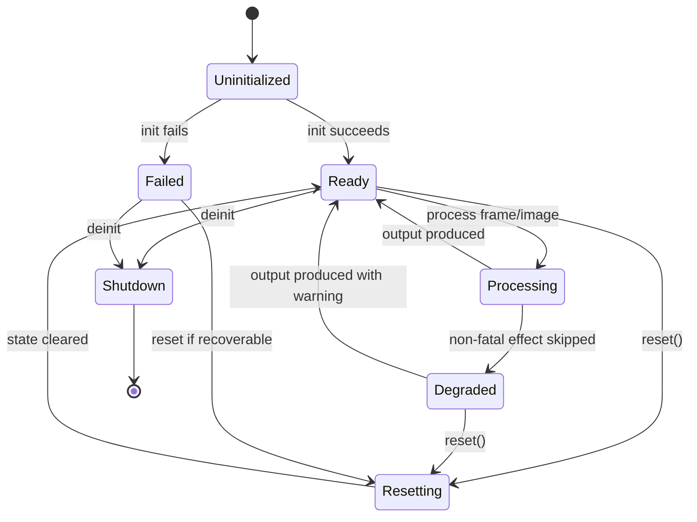
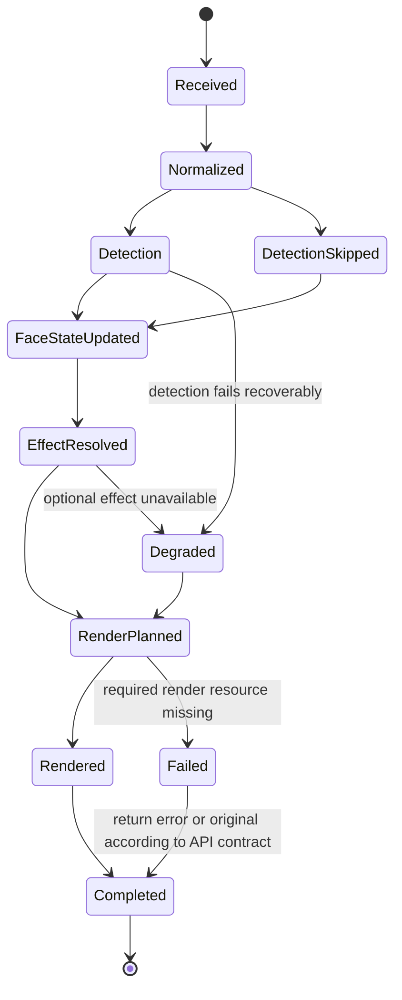
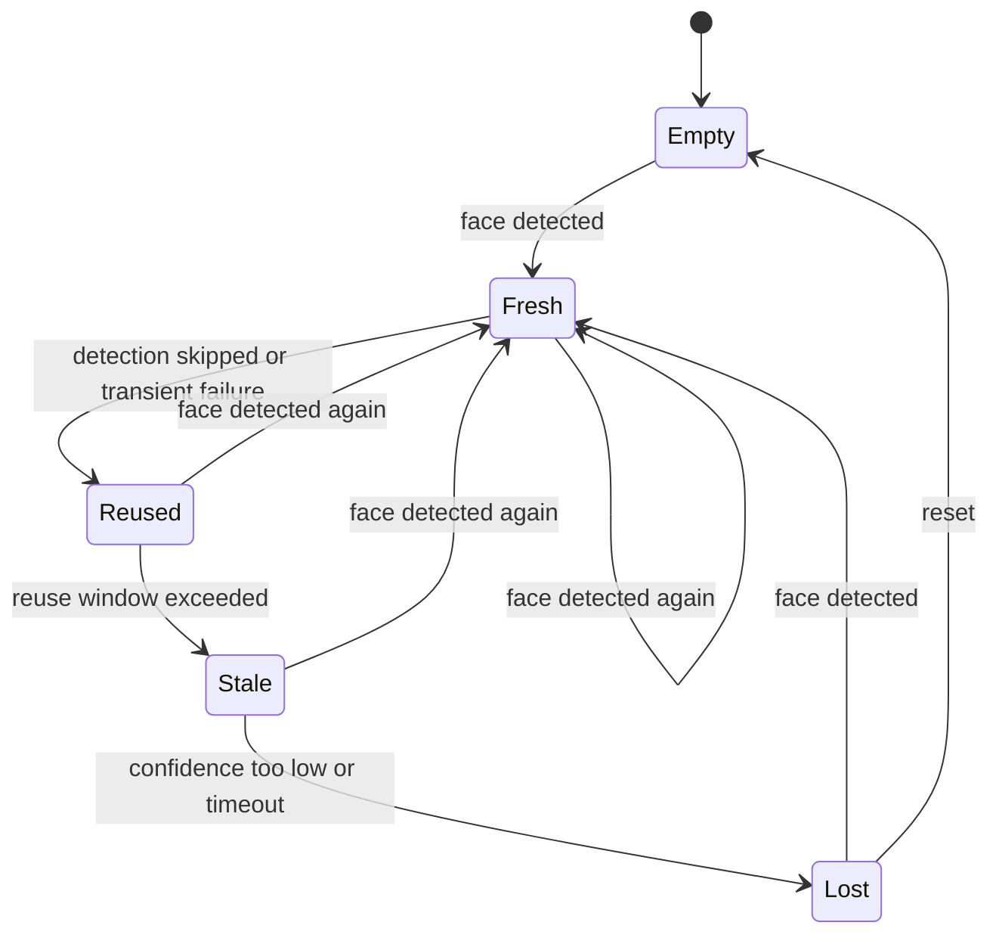

# DESIGN.md

> `beauty` 的核心设计契约。本文记录设计理念、数据结构决策和状态机。
> 包边界看 `ARCHITECTURE.md`，UI 规则看 `FRONTEND.md`，可靠性规则看 `RELIABILITY.md`。

## 1. 设计目标

`beauty` SDK 的核心体验是：宿主 App 传入图像帧与参数，SDK 以稳定、可预测、可实时运行的方式输出处理后的图像。

设计优先级：

1. 实时链路稳定。
2. 数据模型可序列化、可测试、可跨并发域传递。
3. 参数组合可控，不因叠加效果产生明显失真。
4. 渲染、检测、效果、资源彼此解耦。
5. 对外 API 简洁，内部实现可替换。

## 2. 设计原则

| 原则 | 约束 |
| --- | --- |
| Snapshot over shared mutation | 每帧处理读取不可变参数快照，避免跨线程共享可变状态。 |
| Zero means no effect | 所有强度参数默认值必须是无效果状态。 |
| Normalize at the boundary | App UI 的 0...100 或 -100...100 必须在进入 SDK 前归一化。 |
| Platform details stay internal | Vision、Metal、Core Image 的细节不泄漏到公共参数模型。 |
| Detection is optional per effect | 不依赖人脸的效果不得强制等待检测结果。 |
| Degrade before fail | 检测、资源、单个效果失败时优先降级输出原图或跳过该效果。 |
| Deterministic presets | 同一个预设、同一张图、同一版本 SDK 应产生可复现的参数快照。 |

## 3. 核心决策

| ID | Decision | Consequence |
| --- | --- | --- |
| D1 | 第一版 `BeautyEngine.process` 接收显式 `BeautyParameters`。 | Demo 自己管理滑杆状态；SDK 每帧使用传入快照。 |
| D2 | `BeautyParameters` 使用 `Float`，增强型为 `0.0...1.0`，双向型为 `-1.0...1.0`。 | UI 展示范围与内部算法范围解耦。 |
| D3 | SDK 内部统一使用图像归一化坐标。 | Vision、纹理、预览坐标全部通过 `CoordinateMapper` 转换。 |
| D4 | 人脸形变统一表示为 `[WarpControlPoint]`。 | 五官 Provider 可组合，最终由一个 `FaceWarpPass` 执行。 |
| D5 | 预设只生成参数，不直接操作渲染链路。 | 预设可以序列化、测试、导入导出。 |
| D6 | 渲染管线由 `RenderGraph` 组织。 | 效果顺序集中控制，避免每个功能私自插入 pass。 |
| D7 | 内部状态只能由 Engine 拥有或由专门状态对象隔离。 | 检测缓存、点位平滑、纹理缓存不会散落在 UI 层。 |

## 4. 公共数据模型

### 4.1 BeautyConfiguration

`BeautyConfiguration` 是 Engine 创建时的不可变配置。

推荐字段：

| Field | Type | Meaning |
| --- | --- | --- |
| `renderQuality` | `BeautyRenderQuality` | 性能与质量等级。 |
| `preferredFPS` | `Int` | 实时预览目标帧率。 |
| `maxFaceCount` | `Int` | 每帧最多处理的人脸数量。 |
| `isDebugEnabled` | `Bool` | 是否输出调试指标与中间信息。 |
| `resourcePolicy` | `BeautyResourcePolicy` | 内置资源、外部资源、缓存策略。 |

规则：

- 初始化后不可变。
- 必须满足 `Sendable`。
- 不能包含 SwiftUI、UIKit 或宿主 App 状态。

### 4.2 BeautyParameters

`BeautyParameters` 是所有可调效果的唯一公共参数模型。

最低协议：

```swift
public struct BeautyParameters: Codable, Equatable, Sendable
```

参数域：

| Domain | Example | Range |
| --- | --- | --- |
| Skin | `skinSmoothing`, `skinWhitening`, `skinRosy`, `skinSharpen` | `0.0...1.0` |
| Face Shape | `faceSlim`, `faceSmall`, `faceVShape`, `jawSlim` | `0.0...1.0` |
| Chin / Forehead | `chinLength`, `foreheadHeight` | `-1.0...1.0` |
| Eyes | `eyeSize`, `eyeDistance`, `eyeYPosition`, `eyeTailLift` | mixed |
| Nose | `noseSlim`, `noseWingSlim`, `noseTipSize`, `noseBridge` | mixed |
| Mouth | `mouthSize`, `mouthWidth`, `smile`, `lipColor` | mixed |
| Color | `brightness`, `contrast`, `saturation`, `temperature` | mixed |
| Filter | `filterId`, `filterIntensity` | ID + `0.0...1.0` |
| Makeup | `makeupId`, `makeupIntensity` | ID + `0.0...1.0` |

Rules:

- `0` means no effect for numeric parameters unless the field is explicitly bidirectional.
- `nil` resource ID means no resource-backed effect.
- All setters or initializers must clamp invalid values before rendering.
- `process` must not mutate the caller's parameter value.
- Adding a public parameter requires updating this file and `PRODUCT_SENSE.md` acceptance criteria.

### 4.3 BeautyPreset

`BeautyPreset` is a named, versioned parameter bundle.

Recommended shape:

```swift
public struct BeautyPreset: Codable, Equatable, Sendable {
    public let id: String
    public let version: Int
    public let displayName: String
    public let parameters: BeautyParameters
}
```

Rules:

- Applying a preset returns a complete `BeautyParameters` value.
- Presets must not contain hidden code paths.
- Preset JSON must be schema-versioned.
- Invalid preset values are rejected or clamped before they reach rendering.
- User custom presets are product data; validation belongs to `SECURITY.md`.

### 4.4 BeautyFrame

`BeautyFrame` is the internal representation of input media.

Required meaning:

| Field | Meaning |
| --- | --- |
| `pixelBuffer` or image backing | Source image data without `UIImage` in realtime paths. |
| `orientation` | Original capture or asset orientation. |
| `timestamp` | Frame time for smoothing and metrics. |
| `source` | Camera, photo, video, export, or test fixture. |
| `extent` | Pixel size used for coordinate mapping. |

Rules:

- Realtime camera frames must not be retained longer than needed.
- Long-running pipelines must copy or convert frame data into owned buffers.
- Orientation must be normalized before detection and rendering agree on coordinates.

### 4.5 BeautyResult

`BeautyResult` is the result envelope for processed media. Public facade APIs may return a typed `BeautyResult<Output>` when callers need detection/degradation metadata in addition to the processed output.

Recommended fields:

| Field | Meaning |
| --- | --- |
| `output` | Processed pixel buffer, texture-backed image, or CI image. |
| `faces` | Face observations actually used by this frame. |
| `detectionSummary` | Public, geometry-free summary of detection availability and degradation. |
| `warnings` | Non-fatal degradation notes. |
| `metrics` | Timings and pass-level counters when debug is enabled. |

Rules:

- Public compatibility APIs may expose only the processed output, but metadata-aware APIs must preserve `BeautyInputMetadata` and `BeautyDetectionSummary`.
- Warnings must not be logged as fatal errors.
- Metrics and summaries must not include biometric or personally identifying image data, bounding boxes, landmark coordinates, raw Vision objects, raw framework errors, or local file paths.

### 4.6 BeautyInputMetadata

`BeautyInputMetadata` is the public per-input context passed with camera frames and still images.

Required fields:

| Field | Meaning |
| --- | --- |
| `orientation` | `CGImagePropertyOrientation` for capture or image asset normalization. |
| `isInputMirrored` | Whether the source pixels are already mirrored before SDK coordinate interpretation. |
| `isPreviewMirrored` | Whether the Demo/host preview mirrors the displayed result. |
| `source` | Camera, photo, video, export, or test fixture. |
| `timestamp` | Optional frame timestamp for smoothing and diagnostics. |

Rules:

- Orientation, input mirroring, and preview mirroring are explicit metadata, not inferred from UI state.
- Metadata travels with the frame/image into `BeautyEngine.processResult(...)`.
- Preview mirroring does not change the canonical detection model; it only affects display/overlay mapping.

### 4.7 BeautyDetectionSummary

`BeautyDetectionSummary` is the public, geometry-free detection state attached to metadata-aware results.

Allowed public fields:

| Field | Meaning |
| --- | --- |
| `availability` | `notRun`, `disabled`, `noFace`, `usable`, `partial`, `lowConfidence`, `skipped`, `reused`, or `stale`. |
| `reasons` | Redacted reason codes such as no face, missing landmarks, face limit, mapping failure, or stale detection. |
| `faceCount`, `usedFaceCount` | Counts only, never face identity or location. |
| `detectionDurationMs`, `mappingDurationMs` | Optional timing values. |

Rules:

- The summary must not expose points, rects, bounding boxes, landmark coordinates, `VNFaceObservation`, raw framework errors, or local image paths.
- `.mappingFailed` is a degraded state; output should still be possible when rendering can safely skip face-dependent work.
- `.disabled` and `.notRun` are valid non-error states for configuration or first-version no-op paths.

## 5. Detection Models

### 5.1 BeautyFaceObservation

Internal face observation after platform-specific mapping.

Required fields:

| Field | Meaning |
| --- | --- |
| `id` | Stable tracking identifier while the face remains continuous. |
| `boundingBox` | Image-normalized bounding box. |
| `landmarks` | Mapped SDK landmark model. |
| `roll`, `yaw` | Optional pose values. |
| `confidence` | Detector confidence after normalization. |
| `trackingState` | Fresh, reused, stale, or lost. |

Rules:

- `VNFaceObservation` must not cross the `BeautyDetection` boundary.
- Low-confidence faces can be used for light color effects but not strong geometry.
- Face ordering must be deterministic, usually largest face first then stable ID.

### 5.2 BeautyFaceLandmarks

Landmarks are grouped by semantic facial region.

Recommended groups:

```text
faceContour
leftEye
rightEye
leftEyebrow
rightEyebrow
nose
noseCrest
outerLips
innerLips
leftPupil
rightPupil
```

Rules:

- Missing landmark groups must be explicit, not represented as empty valid groups.
- Effect providers must declare required landmark groups.
- Landmark smoothing updates the internal state only after coordinate normalization.

### 5.3 FaceTrackingState

```text
fresh       detected on the current frame
reused      reused from a recent frame because detection was skipped or failed
stale       reused beyond the ideal window; only safe for weak effects
lost        no reliable face is available
```

Rules:

- Reuse window for first version: 1 to 3 frames.
- A face in `stale` state must disable strong geometry.
- A `lost` face clears smoothing state and geometry control points.

## 6. Coordinate Model

SDK internal coordinate space:

```text
ImageNormalized
origin: top-left
x: 0.0 left, 1.0 right
y: 0.0 top, 1.0 bottom
```

Coordinate spaces that must remain explicit:

| Space | Owner | Notes |
| --- | --- | --- |
| `VisionNormalized` | `BeautyDetection` | Vision-specific origin and orientation. |
| `ImagePixel` | `BeautyCore` / `BeautyRender` | Pixel dimensions after orientation handling. |
| `ImageNormalized` | `BeautyCore` | Canonical SDK model. |
| `TextureUV` | `BeautyRender` | GPU texture sampling coordinate. |
| `Preview` | `BeautyDemo` | SwiftUI or UIKit display coordinate. |
| `MirroredPreview` | `BeautyDemo` | Front camera display coordinate. |

Rules:

- No ad hoc coordinate math in effects or UI.
- All conversions go through `CoordinateMapper`.
- Every conversion must include orientation and mirroring inputs.
- The current implementation maps Vision-normalized detector rectangles into canonical `ImageNormalized` bounds before face selection and effect planning.
- Input mirroring and preview mirroring are separate inputs; preview mirroring must not mutate stored face observations.
- Coordinate tests must cover front/back camera, portrait/landscape, and image EXIF orientation.

## 7. Geometry Model

### 7.1 WarpControlPoint

All face geometry effects produce control points:

```swift
public struct WarpControlPoint: Sendable {
    public let source: SIMD2<Float>
    public let target: SIMD2<Float>
    public let radius: Float
    public let strength: Float
    public let falloff: Float
}
```

Field rules:

| Field | Rule |
| --- | --- |
| `source` | Image-normalized position before deformation. |
| `target` | Image-normalized target position after deformation. |
| `radius` | Image-normalized influence radius, clamped to safe bounds. |
| `strength` | Effective contribution after parameter and safety limits. |
| `falloff` | Curve selector or scalar understood by `FaceWarpPass`. |

### 7.2 WarpControlPointProvider

Providers translate one feature domain into control points.

```swift
public protocol WarpControlPointProvider {
    func makeControlPoints(
        face: BeautyFaceObservation,
        parameters: BeautyParameters,
        imageSize: CGSize
    ) -> [WarpControlPoint]
}
```

Provider rules:

- Providers are pure functions of face, parameter snapshot, and image size.
- Providers do not allocate Metal resources.
- Providers return an empty array when required landmarks are unavailable.
- Provider order must be deterministic.
- Conflict resolution happens before points enter `FaceWarpPass`.

### 7.3 Geometry Conflict Policy

When multiple parameters move nearby facial regions:

1. Clamp each parameter to its safe effective range.
2. Generate candidate control points.
3. Merge points with compatible source regions.
4. Reduce strength when overlapping radii exceed safety limits.
5. Skip the weakest optional control point if the result is unstable.

This policy is part of visual correctness and must be tested with fixed faces and fixed parameter sets.

## 8. Effect Model

Effects are internal units that contribute to a render plan.

Recommended conceptual protocol:

```swift
protocol BeautyEffect {
    var id: String { get }
    var requirements: EffectRequirements { get }
    func resolve(context: BeautyEffectContext) throws -> EffectPlan
}
```

Effect categories:

| Category | Requires Face | Typical Pass |
| --- | --- | --- |
| Face geometry | yes | `FaceWarpPass` |
| Skin beauty | usually yes, may degrade to full image | `SkinPass` |
| Color adjustment | no | `ColorPass` |
| LUT filter | no | `LUTPass` |
| Makeup | yes + resources | `MakeupPass` |
| Segmentation | person mask | `SegmentationPass` |

Rules:

- An effect must declare whether missing detection disables it or downgrades it.
- An effect must not read UI state directly.
- Resource-backed effects must receive resolved resource handles, not raw paths.
- Pass order is owned by `RenderGraph`, not individual effects.

## 9. RenderGraph Design

First stable order:

```text
Input
→ FaceWarpPass
→ SkinPass
→ ColorPass
→ LUTPass
→ Output
```

Design rules:

- `FaceWarpPass` consumes merged `[WarpControlPoint]`.
- `SkinPass` runs after geometry so skin treatment follows final face shape.
- `ColorPass` runs before LUT so LUT can define final style.
- `LUTPass` is late because it is a look transform.
- Empty or zero-strength passes are skipped.
- Passes must declare input texture, output texture, uniforms, and recovery behavior.

Future pass insertion points:

| Future Capability | Insert After | Notes |
| --- | --- | --- |
| Makeup | `SkinPass` | Makeup should sit on corrected skin but before final color style. |
| Background segmentation | `FaceWarpPass` or before output | Depends on mask source and desired look. |
| Body warp | Before `FaceWarpPass` or combined geometry stage | Requires separate safety design. |
| Export-only enhancement | Before output | Can be slower than realtime preview. |

## 10. Engine Lifecycle State Machine



State rules:

| State | Meaning | Allowed Work |
| --- | --- | --- |
| `Uninitialized` | Engine resources are not ready. | Create configuration, allocate required contexts. |
| `Ready` | Engine can accept work. | Process frames, process images, reset. |
| `Processing` | One frame or image is being processed. | Read snapshots, update internal caches through isolation. |
| `Degraded` | Output is possible with skipped or weakened work. | Return output with warning and metrics. |
| `Failed` | Required dependency unavailable or unrecoverable error. | Report error, allow reset only when marked recoverable. |
| `Resetting` | Internal caches are being cleared. | Clear detection, smoothing, texture, resource transient state. |
| `Shutdown` | Engine is no longer usable. | Release resources. |

The public API does not need to expose every internal state, but tests should be able to verify transitions through behavior.

## 11. Frame Processing State Machine



Per-frame invariants:

- Parameter snapshot is captured once per frame.
- Detection result used for rendering is recorded in the result metadata.
- A skipped detection frame can reuse recent landmarks only within the allowed reuse window.
- Render pass list is derived after detection state is known.
- A frame never mutates global public parameters.

## 12. Parameter State Machine

```mermaid
stateDiagram-v2
    [*] --> Default
    Default --> Edited: user changes a value
    Edited --> Normalized: clamp and normalize
    Normalized --> Snapshot: process captures parameters
    Snapshot --> Rendered: frame completes
    Edited --> PresetApplied: apply preset
    PresetApplied --> Normalized
    Edited --> Reset: reset to defaults
    Reset --> Default
```

Rules:

- App or API boundary owns editing.
- SDK owns normalization validation before render.
- `Snapshot` values are immutable.
- Preset application must be deterministic and testable.

## 13. Detection State Machine



Rules:

- `Fresh` landmarks can drive all eligible effects.
- `Reused` landmarks can drive moderate geometry and skin effects.
- `Stale` landmarks can drive only weak or non-geometric effects.
- `Lost` disables face-dependent effects.
- `reset()` clears all smoothing and tracking state.
- Public summaries map these internal states to safe availability values: `usable`, `skipped`, `reused`, `stale`, `noFace`, `partial`, `lowConfidence`, `disabled`, and `notRun`.

## 14. Error and Degradation Design

Error categories:

| Category | Example | Default Behavior |
| --- | --- | --- |
| Configuration | Metal unavailable, invalid quality level | Throw during init. |
| Input | Invalid pixel buffer, unsupported format | Throw or return failed result. |
| Detection | Vision transient failure | Reuse recent face or skip face effects. |
| Resource | Missing LUT or makeup package | Skip resource-backed effect with warning. |
| Render | Texture creation or command buffer failure | Throw; do not silently corrupt output. |

Degradation must be explicit:

- Return original image only when API contract allows fallback.
- Attach warning metadata when output is degraded.
- Log internal detail according to `RELIABILITY.md`.
- Do not hide repeated failures that affect visible output.

## 15. Concurrency Design

Concurrency ownership:

| State | Owner |
| --- | --- |
| UI sliders and selected preset | Host App / `BeautyDemo` |
| Active parameter snapshot | Captured by `BeautyEngine` per frame |
| Detection smoothing state | `BeautyDetection` under Engine isolation |
| Texture cache and command queue | `BeautyRender` |
| Resource cache | `BeautyResources` |
| Metrics aggregation | Engine or dedicated metrics collector |

Rules:

- Public value models should be `Sendable`.
- Do not use `@unchecked Sendable` for mutable reference types without a written isolation rule.
- Main actor is only for UI state.
- Detection may run on a detection queue or task.
- Metal encoding runs on the render queue chosen by `BeautyRender`.
- Realtime processing must avoid blocking the main thread.

## 16. Serialization Design

Codable models:

| Model | Purpose |
| --- | --- |
| `BeautyParameters` | Save user adjustments and import/export parameter sets. |
| `BeautyPreset` | Built-in and custom preset definitions. |
| `BeautyResourceManifest` | Resource package identity, version, checksums. |

Rules:

- Serialized JSON must include schema version for presets and resource manifests.
- Unknown fields should be ignored only when forward-compatible.
- Invalid parameter values are clamped or rejected before render.
- Resource IDs are data references, not executable behavior.

## 17. Testable Design Contracts

Each implementation must make these contracts testable:

| Contract | Test Type |
| --- | --- |
| Default `BeautyParameters` produces no visible effect beyond copy/render tolerance. | Render fixture test |
| Parameter normalization clamps invalid values. | Unit test |
| Preset application returns deterministic parameters. | Unit test |
| Coordinate mapping handles orientation and mirroring. | Unit test |
| Detection failure for 1 to 3 frames reuses landmarks, then clears state. | State machine test |
| Multiple warp providers merge into one control point buffer. | Unit or render plan test |
| Empty passes are skipped. | RenderGraph test |
| App-facing API does not expose Vision or Metal internals. | Compile/API review |

## 18. Open Design Watchlist

These are known future design areas, not current first-version requirements:

| Area | Reason to Revisit |
| --- | --- |
| Dense face mesh | Needed for advanced skin, makeup, and high-quality facial refinement. |
| Per-face parameters | Needed when different faces in one frame use different beauty settings. |
| Body reshape model | Requires human landmarks, segmentation, and separate geometry safety policy. |
| Streaming async API | Useful once realtime camera pipeline is formalized beyond per-frame `process`. |
| Export-quality pipeline | Can use slower passes and higher precision than realtime preview. |

