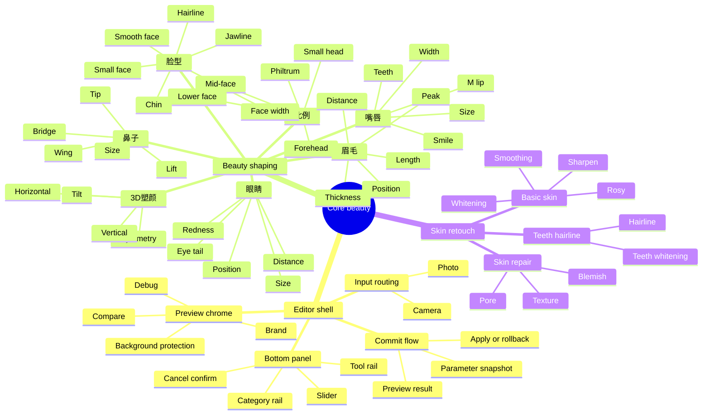

# Meitu Core Beauty Mind Map

This file gives the local, text-based mind map for the Meitu-inspired product/function system. Mermaid is used because it is diffable, local, and readable in plain Markdown.

## Interpretation

- `Editor shell` is the minimal Demo/App orchestration needed for core beauty tools.
- `Beauty shaping` and `Skin retouch` are the core SDK capability domains for this milestone.
- Home, resources/style, AI/background, video/body, and account/gallery are intentionally excluded.
